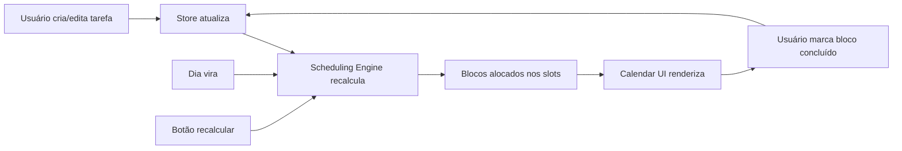

# 00 — Visão Geral do Theomin

## O Problema

O Google Tasks ordena tarefas por data de entrega, mas ignora um fator crítico: **quanto tempo cada tarefa leva para ser concluída**. Uma tarefa que vence amanhã e leva 10 horas não pode ser tratada igual a uma que leva 30 minutos. O resultado: você descobre que está atrasado tarde demais.

## A Solução

**Theomin** é um scheduler inteligente que:

1. Recebe tarefas com **duração estimada**, **prazo**, **data de início** e **classe de prioridade**
2. Conhece a **disponibilidade do usuário** em cada dia da semana
3. **Auto-aloca** blocos de trabalho de 45 minutos (estilo Pomodoro) no calendário
4. **Detecta atrasos antecipadamente** e separa o que não cabe no prazo
5. **Recalcula** automaticamente quando tarefas são criadas, concluídas, ou o dia vira

---

## Escopo do MVP

### Inclui no MVP

| Feature | Descrição |
|---|---|
| **Sistema de Classes** | CRUD de categorias + quadro Kanban de prioridades (drag-and-drop) |
| **Gerenciamento de Tarefas** | Criar, editar, excluir tarefas com duração, prazo, classe, dependências |
| **Tarefas Recorrentes** | Tarefas periódicas com horário fixo, independentes do tempo livre |
| **Dependências** | Tarefa B só começa quando Tarefa A terminar |
| **Disponibilidade Semanal** | Padrão fixo por dia + exceções em datas específicas |
| **Algoritmo de Alocação** | Motor de scheduling com lógica "termine o quanto antes" |
| **Calendário Visual** | Visões semanal e diária, estilo Google Calendar |
| **Progresso por Bloco** | Marcar blocos de 45min como concluídos |
| **Recálculo** | Automático (novo dia, nova tarefa) + manual (botão) |
| **Sistema de Atrasadas** | Painel de tarefas que estouraram o prazo |
| **Task List** | Lista de tarefas estilo Google Tasks, ordenada por prazo |
| **Compromissos Importantes** | Marcos com data na sidebar (provas, entregas, eventos) |
| **Dados Locais** | Tudo salvo no navegador (IndexedDB) |
| **Tema Obsidiana** | Dark mode roxo/escuro |

### Pós-MVP (não implementar agora)

- Dashboard de produtividade / relatórios
- Sync na nuvem / login
- Integração com Google Calendar
- App mobile nativo
- Exportação de dados
- Modo colaborativo

---

## Arquitetura

```
┌─────────────────────────────────────────────────────────┐
│                    THEOMIN (SPA)                         │
├─────────────────────────────────────────────────────────┤
│                                                         │
│  ┌──────────┐  ┌──────────┐  ┌──────────┐  ┌────────┐ │
│  │ Calendar │  │ Task     │  │ Priority │  │Overdue │ │
│  │ View     │  │ List     │  │ Board    │  │Panel   │ │
│  │(Week/Day)│  │(G.Tasks) │  │(Kanban)  │  │        │ │
│  └────┬─────┘  └────┬─────┘  └────┬─────┘  └───┬────┘ │
│       │              │             │             │      │
│  ┌────┴──────────────┴─────────────┴─────────────┴────┐ │
│  │              Zustand State Stores                   │ │
│  │  ┌─────────┐ ┌──────────┐ ┌────────────┐          │ │
│  │  │TaskStore│ │ClassStore│ │AvailStore  │          │ │
│  │  └────┬────┘ └────┬─────┘ └─────┬──────┘          │ │
│  └───────┼───────────┼─────────────┼──────────────────┘ │
│          │           │             │                    │
│  ┌───────┴───────────┴─────────────┴──────────────────┐ │
│  │            Scheduling Engine                        │ │
│  │  (Algoritmo de alocação de blocos)                  │ │
│  └────────────────────┬───────────────────────────────┘ │
│                       │                                 │
│  ┌────────────────────┴───────────────────────────────┐ │
│  │         Dexie.js (IndexedDB Wrapper)                │ │
│  │  Tables: tasks, classes, availability, blocks       │ │
│  └────────────────────────────────────────────────────┘ │
│                                                         │
└─────────────────────────────────────────────────────────┘
```

### Fluxo de Dados



---

## Stack Tecnológica

| Camada | Tecnologia | Justificativa |
|---|---|---|
| **Framework** | React 18 + TypeScript | Componentização, tipagem forte, ecossistema maduro |
| **Build** | Vite 5 | Dev server rápido, HMR instantâneo |
| **Estado** | Zustand | Leve, sem boilerplate, middleware de persistência |
| **Storage** | Dexie.js (IndexedDB) | Dados estruturados locais, queries poderosas, async |
| **Drag & Drop** | @dnd-kit | Moderno, acessível, flexível para Kanban e calendário |
| **Datas** | date-fns | Leve, tree-shakeable, boa API funcional |
| **Ícones** | Lucide React | Clean, modern, bom para dark themes |
| **Estilo** | Vanilla CSS + Custom Properties | Controle total para tema obsidiana, sem bloat |

### Por que essas escolhas?

- **React + TypeScript**: O modelo de dados do Theomin é complexo (tarefas, dependências, recorrências, blocos). TypeScript previne bugs.
- **Zustand**: Mais simples que Redux, sem providers. Perfeito para app local-first.
- **Dexie.js**: localStorage não suporta queries. IndexedDB via Dexie permite buscar tarefas por prazo, classe, status eficientemente.
- **@dnd-kit**: Precisa de drag-and-drop tanto no quadro Kanban quanto no calendário. @dnd-kit lida com ambos.
- **Vanilla CSS**: O tema obsidiana precisa de controle pixel-perfect. CSS custom properties permitem theming sem framework.

---

## Estrutura de Pastas (Projetada)

```
theomin/
├── public/
│   └── favicon.svg
├── src/
│   ├── assets/                    # Imagens, SVGs
│   ├── components/
│   │   ├── calendar/              # CalendarWeek, CalendarDay, TimeBlock
│   │   ├── tasks/                 # TaskForm, TaskList, TaskCard
│   │   ├── classes/               # ClassBoard, ClassCard, PriorityRow
│   │   ├── availability/          # WeeklySchedule, TimeSlotPicker
│   │   ├── overdue/               # OverduePanel, OverdueCard
│   │   └── ui/                    # Button, Modal, Input, Tooltip (shared)
│   ├── engine/
│   │   ├── scheduler.ts           # Algoritmo principal de alocação
│   │   ├── conflict-detector.ts   # Detecção de conflitos e atrasos
│   │   └── dependency-resolver.ts # Resolução de dependências (topological sort)
│   ├── stores/
│   │   ├── taskStore.ts           # Estado das tarefas
│   │   ├── classStore.ts          # Estado das classes/categorias
│   │   ├── availabilityStore.ts   # Estado da disponibilidade
│   │   ├── calendarStore.ts       # Estado da visualização do calendário
│   │   └── blockStore.ts          # Estado dos blocos alocados
│   ├── db/
│   │   ├── database.ts            # Configuração Dexie.js
│   │   └── migrations.ts          # Migrações de schema
│   ├── hooks/                     # Custom hooks
│   ├── types/                     # TypeScript interfaces e types
│   ├── utils/                     # Funções utilitárias
│   ├── styles/
│   │   ├── index.css              # Reset + design tokens + variáveis globais
│   │   ├── calendar.css
│   │   ├── tasks.css
│   │   ├── classes.css
│   │   ├── availability.css
│   │   └── overdue.css
│   ├── App.tsx
│   └── main.tsx
├── index.html
├── tsconfig.json
├── vite.config.ts
└── package.json
```

---

## Navegação do App

O Theomin terá uma sidebar fixa à esquerda com as seguintes seções:

| Ícone | Seção | Descrição |
|---|---|---|
| 📅 | **Calendário** | Visão semanal/diária (tela principal) |
| ✅ | **Tarefas** | Lista estilo Google Tasks |
| 🏷️ | **Classes** | Quadro Kanban de prioridades |
| ⏰ | **Disponibilidade** | Configuração de horários |
| ⚠️ | **Atrasadas** | Painel de tarefas em atraso (com badge de contagem) |
| 📌 | **Compromissos** | Lista de compromissos importantes na sidebar (abaixo da nav) |

A sidebar deve ser colapsável, mostrando apenas ícones quando recolhida.

---

## Próximo Documento

→ [01-SETUP-E-FUNDACAO.md](./01-SETUP-E-FUNDACAO.md) — Setup do projeto, design system e tema obsidiana
