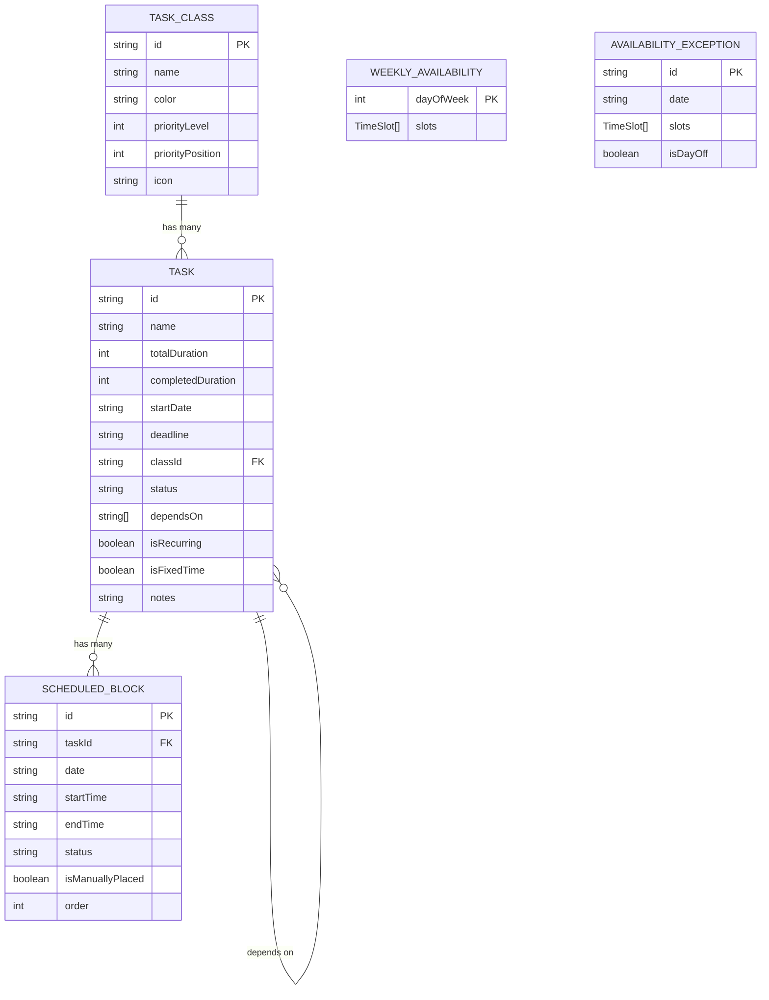

# 02 — Modelo de Dados

Este documento define todos os tipos, o schema do banco IndexedDB, e os stores Zustand que sustentam o Theomin.

---

## 2.1 Tipos TypeScript

### Task (Tarefa)

```typescript
// src/types/task.ts

export type TaskId = string;       // nanoid
export type ClassId = string;      // nanoid
export type BlockId = string;      // nanoid

/** Duração em minutos — sempre múltiplos de 45 */
export type Duration = number;

/** Status de uma tarefa */
export type TaskStatus = 'pending' | 'in_progress' | 'completed' | 'overdue';

/** Tipo de recorrência */
export type RecurrenceType = 'daily' | 'weekly' | 'biweekly' | 'monthly';

export interface Task {
  id: TaskId;
  
  /** Nome da tarefa */
  name: string;
  
  /** Duração total em minutos (múltiplos de 45: 45, 90, 135, 180...) */
  totalDuration: Duration;
  
  /** Duração já concluída em minutos */
  completedDuration: Duration;
  
  /** Data de início (quando pode começar a ser agendada) */
  startDate: string;  // ISO date string 'YYYY-MM-DD'
  
  /** Deadline — a tarefa deve ficar pronta no dia ANTERIOR a esta data */
  deadline: string;   // ISO date string 'YYYY-MM-DD'
  
  /** ID da classe/categoria */
  classId: ClassId;
  
  /** Status atual */
  status: TaskStatus;
  
  /** IDs das tarefas das quais esta depende (predecessoras) */
  dependsOn: TaskId[];
  
  /** Se é uma tarefa recorrente */
  isRecurring: boolean;
  
  /** Configuração de recorrência (se isRecurring = true) */
  recurrence?: RecurrenceConfig;
  
  /** Se tem horário fixo (independente do tempo livre) */
  isFixedTime: boolean;
  
  /** Horário fixo, se aplicável */
  fixedTime?: FixedTimeConfig;
  
  /** Notas opcionais */
  notes?: string;
  
  /** Data de criação */
  createdAt: string;  // ISO datetime
  
  /** Data da última atualização */
  updatedAt: string;  // ISO datetime
}

export interface RecurrenceConfig {
  /** Tipo de recorrência */
  type: RecurrenceType;
  
  /** Dias da semana em que recorre (0=dom, 1=seg, ..., 6=sab) */
  daysOfWeek?: number[];
  
  /** Dia do mês (para recorrência mensal) */
  dayOfMonth?: number;
  
  /** Data de fim da recorrência (opcional — null = infinita) */
  endDate?: string | null;
}

export interface FixedTimeConfig {
  /** Horário de início fixo (ex: "14:00") */
  startTime: string;  // 'HH:mm'
  
  /** Dias da semana em que ocorre */
  daysOfWeek: number[];
}
```

### Class (Classe/Categoria)

```typescript
// src/types/class.ts

export interface TaskClass {
  id: ClassId;
  
  /** Nome da classe (ex: "Faculdade", "Saúde", "Trabalho") */
  name: string;
  
  /** Cor atribuída (key do design token, ex: "purple", "blue") */
  color: string;
  
  /** Nível de prioridade (0 = mais alta). Múltiplas classes podem ter o mesmo nível. */
  priorityLevel: number;
  
  /** Posição horizontal dentro do mesmo nível (0 = mais à esquerda = mais prioritário) */
  priorityPosition: number;
  
  /** Ícone (nome do ícone Lucide) */
  icon?: string;
  
  /** Data de criação */
  createdAt: string;
}
```

### Availability (Disponibilidade)

```typescript
// src/types/availability.ts

/** Dia da semana: 0=domingo, 1=segunda, ..., 6=sábado */
export type DayOfWeek = 0 | 1 | 2 | 3 | 4 | 5 | 6;

/** Uma faixa de tempo disponível */
export interface TimeSlot {
  /** Horário de início (ex: "09:00") */
  startTime: string; // 'HH:mm'
  
  /** Horário de fim (ex: "10:45") */
  endTime: string;   // 'HH:mm'
}

/** Disponibilidade padrão semanal */
export interface WeeklyAvailability {
  /** Uma entrada para cada dia da semana */
  [day: number]: TimeSlot[];  // DayOfWeek → lista de faixas
}

/** Exceção de disponibilidade para um dia específico */
export interface AvailabilityException {
  id: string;
  
  /** Data específica */
  date: string; // 'YYYY-MM-DD'
  
  /** Faixas de tempo para este dia (substitui o padrão semanal) */
  slots: TimeSlot[];
  
  /** Se true, o dia inteiro fica indisponível */
  isDayOff: boolean;
}
```

### Block (Bloco Alocado)

```typescript
// src/types/block.ts

/** Status de um bloco individual */
export type BlockStatus = 'scheduled' | 'completed' | 'missed';

/** Um bloco de 45 minutos alocado no calendário */
export interface ScheduledBlock {
  id: BlockId;
  
  /** ID da tarefa a que pertence */
  taskId: TaskId;
  
  /** Data do bloco */
  date: string; // 'YYYY-MM-DD'
  
  /** Horário de início */
  startTime: string; // 'HH:mm'
  
  /** Horário de fim (sempre startTime + 45min) */
  endTime: string;   // 'HH:mm'
  
  /** Status do bloco */
  status: BlockStatus;
  
  /** Se foi posicionado manualmente pelo usuário (resiste a recálculos até "recalcular") */
  isManuallyPlaced: boolean;
  
  /** Ordem de renderização (para posicionamento visual) */
  order: number;
}

/** Bloco de intervalo (15 minutos entre tarefas) */
export interface BreakBlock {
  date: string;
  startTime: string;
  endTime: string;
  
  /** IDs dos blocos de tarefa antes e depois deste intervalo */
  beforeBlockId: BlockId;
  afterBlockId: BlockId;
}
```

### Overdue (Atrasada)

```typescript
// src/types/overdue.ts

/** Uma tarefa (ou parte dela) que está atrasada */
export interface OverdueEntry {
  taskId: TaskId;
  
  /** Tempo que faltou alocar (minutos) */
  remainingDuration: Duration;
  
  /** Quanto tempo está atrasada (em dias) */
  daysOverdue: number;
  
  /** Deadline original */
  originalDeadline: string;
}
```

---

## 2.2 Schema IndexedDB (Dexie.js)

```typescript
// src/db/database.ts
import Dexie, { Table } from 'dexie';
import { Task } from '@/types/task';
import { TaskClass } from '@/types/class';
import { AvailabilityException } from '@/types/availability';
import { ScheduledBlock } from '@/types/block';

export class TheominDB extends Dexie {
  tasks!: Table<Task, string>;
  classes!: Table<TaskClass, string>;
  availabilityExceptions!: Table<AvailabilityException, string>;
  blocks!: Table<ScheduledBlock, string>;
  settings!: Table<{ key: string; value: any }, string>;

  constructor() {
    super('TheominDB');
    
    this.version(1).stores({
      tasks: 'id, classId, status, deadline, startDate, [status+deadline]',
      classes: 'id, priorityLevel, [priorityLevel+priorityPosition]',
      availabilityExceptions: 'id, date',
      blocks: 'id, taskId, date, [date+startTime], [taskId+date]',
      settings: 'key',
    });
  }
}

export const db = new TheominDB();
```

### Índices explicados

| Tabela | Índice | Para que serve |
|---|---|---|
| `tasks` | `[status+deadline]` | Buscar tarefas pendentes ordenadas por prazo (Task List) |
| `classes` | `[priorityLevel+priorityPosition]` | Ordenar classes por prioridade (Kanban) |
| `blocks` | `[date+startTime]` | Renderizar blocos de um dia no calendário em ordem |
| `blocks` | `[taskId+date]` | Buscar todos os blocos de uma tarefa em um dia |

### Dados de configuração

```typescript
// Configurações salvas na tabela 'settings'
interface Settings {
  weeklyAvailability: WeeklyAvailability;  // Padrão semanal
  sidebarCollapsed: boolean;                // Estado da sidebar
  calendarView: 'week' | 'day';            // Visão atual do calendário
  lastCalculationDate: string;              // Última data que o algoritmo rodou
}
```

A disponibilidade semanal (padrão fixo) é salva como setting pois é um valor global. As exceções são entidades separadas com datas específicas.

---

## 2.3 Stores Zustand

### TaskStore

```typescript
// src/stores/taskStore.ts
import { create } from 'zustand';
import { db } from '@/db/database';
import { Task, TaskId } from '@/types/task';

interface TaskState {
  tasks: Task[];
  loading: boolean;
  
  // Actions
  loadTasks: () => Promise<void>;
  addTask: (task: Omit<Task, 'id' | 'createdAt' | 'updatedAt' | 'completedDuration' | 'status'>) => Promise<Task>;
  updateTask: (id: TaskId, updates: Partial<Task>) => Promise<void>;
  deleteTask: (id: TaskId) => Promise<void>;
  completeTask: (id: TaskId) => Promise<void>;
  
  // Queries
  getTasksByClass: (classId: string) => Task[];
  getTasksByStatus: (status: TaskStatus) => Task[];
  getPendingTasksByDeadline: () => Task[];
  getDependentTasks: (taskId: TaskId) => Task[];
}
```

### ClassStore

```typescript
// src/stores/classStore.ts
import { create } from 'zustand';
import { TaskClass, ClassId } from '@/types/class';

interface ClassState {
  classes: TaskClass[];
  loading: boolean;

  loadClasses: () => Promise<void>;
  addClass: (cls: Omit<TaskClass, 'id' | 'createdAt'>) => Promise<TaskClass>;
  updateClass: (id: ClassId, updates: Partial<TaskClass>) => Promise<void>;
  deleteClass: (id: ClassId) => Promise<void>;
  reorderClasses: (reorderedClasses: TaskClass[]) => Promise<void>;
  
  getClassesByPriority: () => Map<number, TaskClass[]>;
}
```

### AvailabilityStore

```typescript
// src/stores/availabilityStore.ts
import { create } from 'zustand';
import { WeeklyAvailability, AvailabilityException, TimeSlot } from '@/types/availability';

interface AvailabilityState {
  weeklyPattern: WeeklyAvailability;
  exceptions: AvailabilityException[];
  loading: boolean;

  loadAvailability: () => Promise<void>;
  setDaySlots: (day: DayOfWeek, slots: TimeSlot[]) => Promise<void>;
  addException: (exception: Omit<AvailabilityException, 'id'>) => Promise<void>;
  removeException: (id: string) => Promise<void>;
  
  /** Retorna os slots efetivos para uma data (padrão ou exceção) */
  getEffectiveSlots: (date: string) => TimeSlot[];
}
```

### BlockStore

```typescript
// src/stores/blockStore.ts
import { create } from 'zustand';
import { ScheduledBlock, BlockId, BreakBlock } from '@/types/block';

interface BlockState {
  blocks: ScheduledBlock[];
  loading: boolean;

  loadBlocks: () => Promise<void>;
  setBlocks: (blocks: ScheduledBlock[]) => Promise<void>;
  completeBlock: (id: BlockId) => Promise<void>;
  moveBlock: (id: BlockId, newDate: string, newStartTime: string) => Promise<void>;
  
  /** Retorna blocos de um dia específico, ordenados por horário */
  getBlocksForDate: (date: string) => ScheduledBlock[];
  
  /** Calcula intervalos (breaks) entre blocos de tarefas diferentes */
  getBreaksForDate: (date: string) => BreakBlock[];
  
  /** Retorna blocos de uma tarefa específica */
  getBlocksForTask: (taskId: string) => ScheduledBlock[];
}
```

### CalendarStore

```typescript
// src/stores/calendarStore.ts
import { create } from 'zustand';

interface CalendarState {
  /** Data atualmente focada */
  currentDate: string;
  
  /** Tipo de visão */
  viewType: 'week' | 'day';
  
  setCurrentDate: (date: string) => void;
  setViewType: (type: 'week' | 'day') => void;
  goToToday: () => void;
  goForward: () => void;
  goBackward: () => void;
}
```

---

## 2.4 Validações do Modelo

### Regras de validação para tarefas

```typescript
// src/utils/validation.ts

/** Duração deve ser múltiplo de 45 minutos */
export function isValidDuration(minutes: number): boolean {
  return minutes > 0 && minutes % 45 === 0;
}

/** Opções de duração disponíveis: 45, 90, 135, 180, 225, 270... */
export function getDurationOptions(maxMinutes = 720): { label: string; value: number }[] {
  const options = [];
  for (let m = 45; m <= maxMinutes; m += 45) {
    const hours = Math.floor(m / 60);
    const mins = m % 60;
    const label = hours > 0 
      ? mins > 0 ? `${hours}h${mins}` : `${hours}h`
      : `${mins}min`;
    options.push({ label, value: m });
  }
  return options;
  // → 45min, 1h30, 2h15, 3h, 3h45, 4h30, ...
}

/** Valida que um TimeSlot respeita os múltiplos */
export function isValidTimeSlot(slot: TimeSlot): boolean {
  const startMinutes = timeToMinutes(slot.startTime);
  const endMinutes = timeToMinutes(slot.endTime);
  const duration = endMinutes - startMinutes;
  
  // A duração do slot deve permitir pelo menos um bloco de 45min
  // Padrão: 45, 45+15+45=105, 105+15+45=165, ...
  // Ou seja: 45, 105, 165, 225, 285...
  // Fórmula: 45 + (n-1)*60 para n blocos
  if (duration < 45) return false;
  
  const remaining = duration - 45;
  if (remaining === 0) return true;
  return remaining % 60 === 0;
}

/** Deadline deve ser posterior à data de início */
export function isValidDeadline(startDate: string, deadline: string): boolean {
  return new Date(deadline) > new Date(startDate);
}

/** Verificação de dependências circulares */
export function hasCircularDependency(
  taskId: TaskId, 
  dependsOn: TaskId[], 
  allTasks: Task[]
): boolean {
  const visited = new Set<TaskId>();
  
  function dfs(currentId: TaskId): boolean {
    if (currentId === taskId) return true;
    if (visited.has(currentId)) return false;
    visited.add(currentId);
    
    const task = allTasks.find(t => t.id === currentId);
    if (!task) return false;
    
    return task.dependsOn.some(depId => dfs(depId));
  }
  
  return dependsOn.some(depId => dfs(depId));
}
```

---

## 2.5 Diagrama Entidade-Relacionamento



---

## 2.6 Migração e Seed Data

### Dados iniciais (seed)

Ao abrir o app pela primeira vez, criar:

```typescript
// src/db/seed.ts

export async function seedDatabase() {
  const taskCount = await db.tasks.count();
  if (taskCount > 0) return; // Já tem dados
  
  // Classes padrão
  const defaultClasses: Omit<TaskClass, 'id' | 'createdAt'>[] = [
    { name: 'Trabalho',   color: 'blue',   priorityLevel: 0, priorityPosition: 0, icon: 'Briefcase' },
    { name: 'Faculdade',  color: 'purple', priorityLevel: 0, priorityPosition: 1, icon: 'GraduationCap' },
    { name: 'Saúde',      color: 'green',  priorityLevel: 1, priorityPosition: 0, icon: 'Heart' },
    { name: 'Pessoal',    color: 'orange', priorityLevel: 2, priorityPosition: 0, icon: 'User' },
  ];
  
  // Disponibilidade padrão (seg-sex, 9h-10h45 e 14h-16h45)
  const defaultAvailability: WeeklyAvailability = {
    0: [],  // Domingo
    1: [{ startTime: '09:00', endTime: '10:45' }, { startTime: '14:00', endTime: '16:45' }],
    2: [{ startTime: '09:00', endTime: '10:45' }, { startTime: '14:00', endTime: '16:45' }],
    3: [{ startTime: '09:00', endTime: '10:45' }, { startTime: '14:00', endTime: '16:45' }],
    4: [{ startTime: '09:00', endTime: '10:45' }, { startTime: '14:00', endTime: '16:45' }],
    5: [{ startTime: '09:00', endTime: '10:45' }, { startTime: '14:00', endTime: '16:45' }],
    6: [],  // Sábado
  };
  
  // ... salvar no banco
}
```

---

## 2.7 Checklist do Modelo de Dados

- [ ] Criar `src/types/task.ts` com todos os tipos de tarefa
- [ ] Criar `src/types/class.ts` com tipo TaskClass
- [ ] Criar `src/types/availability.ts` com tipos de disponibilidade
- [ ] Criar `src/types/block.ts` com tipos de bloco
- [ ] Criar `src/types/overdue.ts` com tipo OverdueEntry
- [ ] Criar `src/db/database.ts` com schema Dexie
- [ ] Criar `src/db/seed.ts` com dados iniciais
- [ ] Criar `src/stores/taskStore.ts`
- [ ] Criar `src/stores/classStore.ts`
- [ ] Criar `src/stores/availabilityStore.ts`
- [ ] Criar `src/stores/blockStore.ts`
- [ ] Criar `src/stores/calendarStore.ts`
- [ ] Criar `src/utils/validation.ts` com regras de validação
- [ ] Testar que o banco é criado e populado corretamente

---

## Próximo Documento

→ [03-SISTEMA-DE-CLASSES.md](./03-SISTEMA-DE-CLASSES.md) — CRUD de classes e quadro Kanban de prioridades
