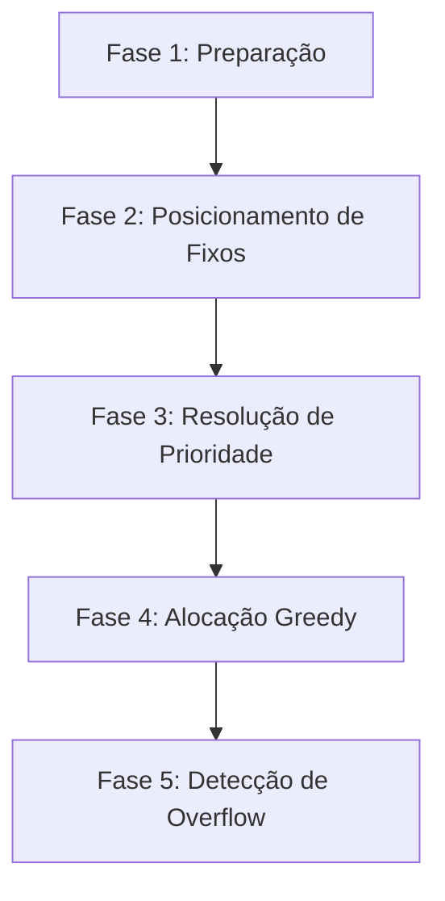

# 06 — Algoritmo de Alocação

Este é o **coração do Theomin** — o motor que decide quais blocos de trabalho vão em quais horários do calendário. É o documento mais complexo e crítico de toda a implementação.

---

## 6.1 Visão Geral do Algoritmo

### Objetivo

Dado:
- Um conjunto de **tarefas** (com duração, prazo, classe, dependências)
- Um sistema de **prioridades por classe**
- A **disponibilidade** do usuário (padrão semanal + exceções)
- **Tarefas de horário fixo** (imóveis)
- **Blocos já concluídos** (imóveis)
- **Blocos manualmente posicionados** (resistem ao recálculo, a menos que seja recálculo manual)

Produzir:
- Uma lista de **ScheduledBlocks** posicionados no calendário
- Uma lista de **OverdueEntries** para tarefas que não cabem no prazo

### Princípios

1. **"Termine tudo o quanto antes"** — tarefas de maior prioridade são front-loaded nos primeiros slots disponíveis
2. **Deadline-aware** — tarefas com prazo mais apertado podem "furar fila" de prioridade
3. **Finish day before** — o objetivo é que tarefas fiquem prontas no dia **anterior** ao deadline
4. **Partial overflow** — se uma tarefa não cabe inteira no prazo, o que cabe entra no calendário e o resto vai para atrasadas
5. **Dependency-aware** — tarefas dependentes só podem ser agendadas após a conclusão de suas predecessoras

---

## 6.2 Entradas e Saídas

```typescript
// src/engine/scheduler.ts

interface SchedulerInput {
  tasks: Task[];
  classes: TaskClass[];
  weeklyAvailability: WeeklyAvailability;
  exceptions: AvailabilityException[];
  existingBlocks: ScheduledBlock[];     // Blocos já concluídos ou manualmente posicionados
  today: string;                         // Data atual (YYYY-MM-DD)
  isManualRecalc: boolean;              // Se true, ignora blocos manualmente posicionados
}

interface SchedulerOutput {
  blocks: ScheduledBlock[];             // Todos os blocos a serem colocados no calendário
  overdue: OverdueEntry[];              // Tarefas ou partes que não cabem
  warnings: SchedulerWarning[];         // Avisos (ex: "tarefa X tem deadline apertado")
}

interface SchedulerWarning {
  taskId: TaskId;
  type: 'tight_deadline' | 'dependency_delay' | 'partial_overflow';
  message: string;
}
```

---

## 6.3 Fases do Algoritmo

O algoritmo executa em **5 fases sequenciais**:



---

### Fase 1: Preparação

**Objetivo**: Preparar os dados de entrada para o algoritmo.

```typescript
function phase1_prepare(input: SchedulerInput): PreparedData {
  const horizon = 90; // Planejar até 90 dias no futuro
  const endDate = addDays(parseDate(input.today), horizon);
  
  // 1. Gerar o "mapa de slots" — todos os slots disponíveis de hoje até o horizonte
  const slotMap = generateSlotMap(
    input.today, 
    endDate, 
    input.weeklyAvailability, 
    input.exceptions
  );
  
  // 2. Filtrar tarefas: apenas pendentes e em progresso
  const activeTasks = input.tasks.filter(t => 
    t.status === 'pending' || t.status === 'in_progress'
  );
  
  // 3. Calcular duração restante de cada tarefa
  const taskRemaining = new Map<TaskId, number>();
  for (const task of activeTasks) {
    taskRemaining.set(task.id, task.totalDuration - task.completedDuration);
  }
  
  // 4. Separar blocos existentes
  const completedBlocks = input.existingBlocks.filter(b => b.status === 'completed');
  const manualBlocks = input.isManualRecalc 
    ? [] // Recálculo manual ignora posicionamento manual
    : input.existingBlocks.filter(b => b.isManuallyPlaced && b.status === 'scheduled');
  
  // 5. Resolver dependências (ordenação topológica)
  const dependencyOrder = topologicalSort(activeTasks);
  
  return { slotMap, activeTasks, taskRemaining, completedBlocks, manualBlocks, dependencyOrder };
}
```

#### Geração do Mapa de Slots

```typescript
interface DaySlots {
  date: string;
  slots: TimeSlot[];             // Faixas de disponibilidade
  availableMinutes: number;      // Minutos totais disponíveis
  blockCapacity: number;         // Quantos blocos de 45min cabem
}

function generateSlotMap(
  startDate: string,
  endDate: string,
  weekly: WeeklyAvailability,
  exceptions: AvailabilityException[]
): Map<string, DaySlots> {
  const map = new Map<string, DaySlots>();
  let current = parseDate(startDate);
  
  while (current <= parseDate(endDate)) {
    const dateStr = formatDate(current);
    const dayOfWeek = current.getDay();
    
    // Verificar exceção
    const exception = exceptions.find(e => e.date === dateStr);
    let slots: TimeSlot[];
    
    if (exception) {
      slots = exception.isDayOff ? [] : exception.slots;
    } else {
      slots = weekly[dayOfWeek] || [];
    }
    
    const totalMinutes = slots.reduce((sum, s) => 
      sum + (timeToMinutes(s.endTime) - timeToMinutes(s.startTime)), 0
    );
    
    const blockCapacity = slots.reduce((sum, s) => {
      const duration = timeToMinutes(s.endTime) - timeToMinutes(s.startTime);
      return sum + (duration >= 45 ? 1 + Math.floor((duration - 45) / 60) : 0);
    }, 0);
    
    map.set(dateStr, { date: dateStr, slots, availableMinutes: totalMinutes, blockCapacity });
    current = addDays(current, 1);
  }
  
  return map;
}
```

---

### Fase 2: Posicionamento de Fixos

**Objetivo**: Colocar tarefas de horário fixo e blocos imóveis no calendário, e reduzir os slots disponíveis.

```typescript
function phase2_placeFixed(
  slotMap: Map<string, DaySlots>,
  fixedTasks: Task[],
  completedBlocks: ScheduledBlock[],
  manualBlocks: ScheduledBlock[]
): PlacedBlocks {
  const placed: ScheduledBlock[] = [];
  
  // 1. Colocar blocos já concluídos (imóveis)
  for (const block of completedBlocks) {
    placed.push(block);
    subtractFromSlotMap(slotMap, block.date, block.startTime, block.endTime);
  }
  
  // 2. Colocar blocos manualmente posicionados (imóveis até recálculo manual)
  for (const block of manualBlocks) {
    placed.push(block);
    subtractFromSlotMap(slotMap, block.date, block.startTime, block.endTime);
  }
  
  // 3. Colocar tarefas de horário fixo
  for (const task of fixedTasks) {
    if (!task.fixedTime) continue;
    
    const { startTime, daysOfWeek } = task.fixedTime;
    const blocksNeeded = task.totalDuration / 45;
    
    // Para cada dia do horizonte que corresponde ao dia da semana
    for (const [dateStr, daySlots] of slotMap) {
      const dayOfWeek = new Date(dateStr).getDay();
      if (!daysOfWeek.includes(dayOfWeek)) continue;
      if (dateStr < task.startDate) continue;
      
      // Colocar blocos consecutivos a partir do startTime
      let currentTime = startTime;
      for (let i = 0; i < blocksNeeded; i++) {
        const endTime = addMinutesToTime(currentTime, 45);
        
        placed.push({
          id: nanoid(),
          taskId: task.id,
          date: dateStr,
          startTime: currentTime,
          endTime: endTime,
          status: 'scheduled',
          isManuallyPlaced: false,
          order: i,
        });
        
        subtractFromSlotMap(slotMap, dateStr, currentTime, endTime);
        
        // Próximo bloco: +45min trabalho + 15min intervalo
        currentTime = addMinutesToTime(currentTime, 60);
      }
    }
  }
  
  return { placed, updatedSlotMap: slotMap };
}
```

---

### Fase 3: Resolução de Prioridade

**Objetivo**: Ordenar as tarefas na sequência em que devem ser alocadas.

Este é o passo mais sutil. A ordem não é simplesmente "prioridade da classe", porque deadlines apertados podem promover tarefas de menor prioridade.

```typescript
function phase3_prioritize(
  tasks: Task[],
  classes: TaskClass[],
  taskRemaining: Map<TaskId, number>,
  slotMap: Map<string, DaySlots>,
  dependencyOrder: TaskId[],
  today: string
): Task[] {
  // Criar mapa de prioridade de classe
  const classPriority = new Map<ClassId, number>();
  for (const cls of classes) {
    // Score = priorityLevel * 100 + priorityPosition
    // Menor = mais prioritário
    classPriority.set(cls.id, cls.priorityLevel * 100 + cls.priorityPosition);
  }
  
  // Calcular "urgência" de cada tarefa
  const taskUrgency = new Map<TaskId, number>();
  
  for (const task of tasks) {
    if (task.isFixedTime) continue; // Já alocadas na Fase 2
    
    const remaining = taskRemaining.get(task.id) || 0;
    const blocksNeeded = remaining / 45;
    
    // Contar blocos disponíveis entre hoje e o deadline efetivo (deadline - 1 dia)
    const effectiveDeadline = addDays(parseDate(task.deadline), -1);
    let blocksAvailable = 0;
    
    for (const [dateStr, daySlots] of slotMap) {
      if (dateStr < today) continue;
      if (dateStr > formatDate(effectiveDeadline)) break;
      if (dateStr < task.startDate) continue;
      blocksAvailable += daySlots.blockCapacity;
    }
    
    // Urgência = blocos necessários / blocos disponíveis
    // Quanto mais perto de 1 (ou acima), mais urgente
    const urgency = blocksAvailable > 0 ? blocksNeeded / blocksAvailable : Infinity;
    taskUrgency.set(task.id, urgency);
  }
  
  // Ordenar tarefas
  const sorted = tasks
    .filter(t => !t.isFixedTime)
    .sort((a, b) => {
      // 1. Respeitar dependências (ordem topológica)
      const orderA = dependencyOrder.indexOf(a.id);
      const orderB = dependencyOrder.indexOf(b.id);
      
      // Se A depende de B, B deve vir primeiro
      if (a.dependsOn.includes(b.id)) return 1;
      if (b.dependsOn.includes(a.id)) return -1;
      
      // 2. Tarefas com urgência > 0.7 (deadline apertado) ganham boost
      const urgA = taskUrgency.get(a.id) || 0;
      const urgB = taskUrgency.get(b.id) || 0;
      
      const urgentA = urgA > 0.7;
      const urgentB = urgB > 0.7;
      
      // Se só uma é urgente, ela vai primeiro
      if (urgentA && !urgentB) return -1;
      if (urgentB && !urgentA) return 1;
      
      // Se ambas são urgentes, a mais urgente primeiro
      if (urgentA && urgentB) return urgB - urgA;
      
      // 3. Se nenhuma é urgente, usar prioridade de classe
      const prioA = classPriority.get(a.classId) || 999;
      const prioB = classPriority.get(b.classId) || 999;
      
      if (prioA !== prioB) return prioA - prioB;
      
      // 4. Desempate: deadline mais cedo primeiro
      return a.deadline.localeCompare(b.deadline);
    });
  
  return sorted;
}
```

### Threshold de urgência (0.7)

- **Urgência ≤ 0.5**: tarefa tem bastante tempo — respeitar prioridade de classe
- **Urgência 0.5 – 0.7**: atenção, mas prioridade de classe ainda manda
- **Urgência > 0.7**: deadline apertado — promover independente da classe
- **Urgência ≥ 1.0**: impossível completar a tempo — overflow parcial
- **Urgência = Infinity**: sem slots disponíveis — tudo vai para atrasadas

---

### Fase 4: Alocação Greedy

**Objetivo**: Alocar blocos de 45min nos slots disponíveis, seguindo a ordem de prioridade.

```typescript
function phase4_allocate(
  sortedTasks: Task[],
  taskRemaining: Map<TaskId, number>,
  slotMap: Map<string, DaySlots>,
  today: string,
  dependencyCompletionDates: Map<TaskId, string> // Data estimada de conclusão de cada tarefa
): AllocationResult {
  const allocatedBlocks: ScheduledBlock[] = [];
  const overflowTasks: Map<TaskId, number> = new Map(); // taskId → minutos que não couberam
  
  for (const task of sortedTasks) {
    const remaining = taskRemaining.get(task.id) || 0;
    if (remaining <= 0) continue;
    
    let blocksToAllocate = remaining / 45;
    
    // Determinar data de início efetiva
    let effectiveStart = task.startDate;
    
    // Se tem dependências, só pode começar após a última dependência
    for (const depId of task.dependsOn) {
      const depEnd = dependencyCompletionDates.get(depId);
      if (depEnd && depEnd > effectiveStart) {
        effectiveStart = depEnd;
      }
    }
    
    // Se a data de início efetiva é posterior a hoje, começar de lá
    if (effectiveStart < today) effectiveStart = today;
    
    // Deadline efetivo (dia anterior ao deadline)
    const effectiveDeadline = formatDate(addDays(parseDate(task.deadline), -1));
    
    // Iterar pelos dias do slotMap, alocando blocos
    let blocksAllocated = 0;
    let lastAllocatedDate = effectiveStart;
    
    for (const [dateStr, daySlots] of slotMap) {
      if (dateStr < effectiveStart) continue;
      if (blocksAllocated >= blocksToAllocate) break;
      
      // Se passou do deadline, o restante vai para overflow
      if (dateStr > effectiveDeadline) {
        const overflowMinutes = (blocksToAllocate - blocksAllocated) * 45;
        overflowTasks.set(task.id, overflowMinutes);
        break;
      }
      
      // Tentar alocar blocos neste dia
      const dayBlocks = allocateBlocksInDay(
        task.id,
        daySlots,
        blocksToAllocate - blocksAllocated,
        dateStr,
        allocatedBlocks // Para calcular intervalos entre tarefas diferentes
      );
      
      allocatedBlocks.push(...dayBlocks);
      blocksAllocated += dayBlocks.length;
      
      if (dayBlocks.length > 0) {
        lastAllocatedDate = dateStr;
      }
    }
    
    // Se não conseguiu alocar tudo e não passou do deadline ainda
    // (acontece quando acabam os slots no horizonte)
    if (blocksAllocated < blocksToAllocate && !overflowTasks.has(task.id)) {
      const overflowMinutes = (blocksToAllocate - blocksAllocated) * 45;
      overflowTasks.set(task.id, overflowMinutes);
    }
    
    // Registrar data estimada de conclusão para dependências
    dependencyCompletionDates.set(task.id, lastAllocatedDate);
  }
  
  return { allocatedBlocks, overflowTasks };
}
```

### Alocação de blocos em um dia

```typescript
function allocateBlocksInDay(
  taskId: TaskId,
  daySlots: DaySlots,
  maxBlocks: number,
  date: string,
  existingBlocks: ScheduledBlock[]
): ScheduledBlock[] {
  const newBlocks: ScheduledBlock[] = [];
  let blocksPlaced = 0;
  
  // Obter todos os blocos já alocados neste dia (para evitar conflitos)
  const dayExistingBlocks = existingBlocks
    .filter(b => b.date === date)
    .sort((a, b) => a.startTime.localeCompare(b.startTime));
  
  for (const slot of daySlots.slots) {
    if (blocksPlaced >= maxBlocks) break;
    
    // Encontrar espaços livres dentro deste slot
    const freeSpaces = findFreeSpaces(slot, dayExistingBlocks);
    
    for (const space of freeSpaces) {
      if (blocksPlaced >= maxBlocks) break;
      
      let currentTime = space.startTime;
      
      while (blocksPlaced < maxBlocks) {
        const endTime = addMinutesToTime(currentTime, 45);
        
        // Verificar se o bloco cabe no espaço livre
        if (timeToMinutes(endTime) > timeToMinutes(space.endTime)) break;
        
        // Verificar se precisa de intervalo
        // (se o bloco anterior é de uma tarefa DIFERENTE)
        const prevBlock = getLastBlockBefore(currentTime, date, [...existingBlocks, ...newBlocks]);
        if (prevBlock && prevBlock.taskId !== taskId) {
          // Adicionar 15min de intervalo
          const withBreak = addMinutesToTime(prevBlock.endTime, 15);
          if (timeToMinutes(withBreak) > timeToMinutes(currentTime)) {
            currentTime = withBreak;
            const newEndTime = addMinutesToTime(currentTime, 45);
            if (timeToMinutes(newEndTime) > timeToMinutes(space.endTime)) break;
          }
        }
        
        // Alocar o bloco
        newBlocks.push({
          id: nanoid(),
          taskId,
          date,
          startTime: currentTime,
          endTime: addMinutesToTime(currentTime, 45),
          status: 'scheduled',
          isManuallyPlaced: false,
          order: blocksPlaced,
        });
        
        blocksPlaced++;
        
        // Próximo bloco: se é da mesma tarefa, intervalo de 15min
        currentTime = addMinutesToTime(currentTime, 60); // 45 trabalho + 15 intervalo
      }
    }
  }
  
  return newBlocks;
}
```

---

### Fase 5: Detecção de Overflow

**Objetivo**: Gerar a lista de tarefas atrasadas a partir dos overflows da Fase 4.

```typescript
function phase5_detectOverflow(
  overflowTasks: Map<TaskId, number>,
  tasks: Task[],
  today: string
): OverdueEntry[] {
  const overdueEntries: OverdueEntry[] = [];
  
  for (const [taskId, remainingMinutes] of overflowTasks) {
    const task = tasks.find(t => t.id === taskId);
    if (!task) continue;
    
    const deadlineDate = parseDate(task.deadline);
    const todayDate = parseDate(today);
    const daysOverdue = Math.max(0, differenceInDays(todayDate, deadlineDate));
    
    overdueEntries.push({
      taskId,
      remainingDuration: remainingMinutes,
      daysOverdue,
      originalDeadline: task.deadline,
    });
  }
  
  // Ordenar: mais atrasada primeiro
  overdueEntries.sort((a, b) => b.daysOverdue - a.daysOverdue);
  
  return overdueEntries;
}
```

---

## 6.4 Ordenação Topológica (Dependências)

```typescript
// src/engine/dependency-resolver.ts

function topologicalSort(tasks: Task[]): TaskId[] {
  const graph = new Map<TaskId, TaskId[]>();
  const inDegree = new Map<TaskId, number>();
  
  // Construir grafo
  for (const task of tasks) {
    graph.set(task.id, []);
    inDegree.set(task.id, 0);
  }
  
  for (const task of tasks) {
    for (const depId of task.dependsOn) {
      if (graph.has(depId)) {
        graph.get(depId)!.push(task.id);
        inDegree.set(task.id, (inDegree.get(task.id) || 0) + 1);
      }
    }
  }
  
  // BFS (Kahn's algorithm)
  const queue: TaskId[] = [];
  for (const [id, degree] of inDegree) {
    if (degree === 0) queue.push(id);
  }
  
  const result: TaskId[] = [];
  while (queue.length > 0) {
    const current = queue.shift()!;
    result.push(current);
    
    for (const neighbor of graph.get(current) || []) {
      inDegree.set(neighbor, (inDegree.get(neighbor) || 0) - 1);
      if (inDegree.get(neighbor) === 0) {
        queue.push(neighbor);
      }
    }
  }
  
  // Se result.length < tasks.length → ciclo detectado (erro)
  if (result.length < tasks.length) {
    throw new Error('Dependência circular detectada!');
  }
  
  return result;
}
```

---

## 6.5 Intervalos (Breaks)

Os intervalos de 15 minutos seguem regras específicas:

| Cenário | Intervalo? |
|---|---|
| Dois blocos da **mesma tarefa** consecutivos | ✅ Sim, 15min |
| Dois blocos de **tarefas diferentes** consecutivos | ✅ Sim, 15min |
| Bloco seguido de **espaço livre** (fim do slot) | ❌ Não |
| Bloco no **início** do dia/slot | ❌ Não |
| Blocos em **faixas de tempo diferentes** | ❌ Não (já tem gap natural) |

### Cálculo de breaks para visualização

```typescript
function calculateBreaks(blocks: ScheduledBlock[]): BreakBlock[] {
  const breaks: BreakBlock[] = [];
  const sorted = [...blocks].sort((a, b) => a.startTime.localeCompare(b.startTime));
  
  for (let i = 0; i < sorted.length - 1; i++) {
    const current = sorted[i];
    const next = sorted[i + 1];
    
    // Verificar se há exatamente 15min entre os blocos
    const gapStart = current.endTime;
    const gapEnd = next.startTime;
    const gap = timeToMinutes(gapEnd) - timeToMinutes(gapStart);
    
    if (gap === 15) {
      breaks.push({
        date: current.date,
        startTime: gapStart,
        endTime: gapEnd,
        beforeBlockId: current.id,
        afterBlockId: next.id,
      });
    }
  }
  
  return breaks;
}
```

---

## 6.6 Triggers de Recálculo

### Automáticos

| Evento | Ação |
|---|---|
| Nova tarefa criada | Recálculo completo |
| Tarefa editada (duração, deadline, classe) | Recálculo completo |
| Tarefa excluída | Recálculo completo |
| Virada do dia (meia-noite) | Recálculo + marcar blocos não concluídos como `missed` |
| Bloco marcado como concluído | Verificar se tarefa foi completada |

### Manual

| Evento | Ação |
|---|---|
| Botão "Recalcular" | Recálculo completo ignorando posicionamentos manuais |

### Lógica da virada do dia

```typescript
function handleDayChange(previousDate: string, newDate: string) {
  // 1. Blocos agendados do dia anterior que NÃO foram completados → missed
  const missedBlocks = blocks.filter(b => 
    b.date === previousDate && b.status === 'scheduled'
  );
  
  for (const block of missedBlocks) {
    block.status = 'missed'; // Não aparece mais no calendário passado
    
    // Incrementar duração restante da tarefa (não foi feito)
    // Na verdade, a duração restante já está correta pois 
    // completedDuration só aumenta quando o bloco é completado
  }
  
  // 2. Recalcular toda a agenda
  await runScheduler({ isManualRecalc: false });
}
```

---

## 6.7 Complexidade e Performance

### Análise

- **N** = número de tarefas ativas
- **D** = número de dias no horizonte (90)
- **S** = número médio de slots por dia (~3)

| Fase | Complexidade | Notas |
|---|---|---|
| Fase 1 (Preparação) | O(D × S) | Gerar mapa de slots |
| Fase 2 (Fixos) | O(F × D) | F = tarefas fixas |
| Fase 3 (Prioridade) | O(N log N + N × D) | Sort + cálculo de urgência |
| Fase 4 (Alocação) | O(N × D × S) | Para cada tarefa, iterar dias e slots |
| Fase 5 (Overflow) | O(N log N) | Sort de overdue |

**Total**: O(N × D × S) — para 50 tarefas e 90 dias com 3 slots, são ~13.500 operações. **Extremamente rápido**, executa em < 10ms.

### Otimizações futuras (se necessário)

- Cache do mapa de slots (invalidar só quando availability muda)
- Recálculo incremental (só recalcular tarefas afetadas)
- Web Worker para não bloquear a UI

---

## 6.8 Testes do Algoritmo

### Cenários críticos a testar

| # | Cenário | Resultado esperado |
|---|---|---|
| 1 | Uma tarefa, slots suficientes | Alocada nos primeiros slots disponíveis |
| 2 | Duas tarefas, mesma prioridade | Deadline mais cedo vai primeiro |
| 3 | Alta prioridade vs deadline apertado | Deadline apertado promovido se urgência > 0.7 |
| 4 | Tarefa não cabe no prazo | Parcialmente alocada + overflow em atrasadas |
| 5 | Tarefa totalmente impossível | Toda em atrasadas |
| 6 | Dependência A → B | B só começa após último bloco de A |
| 7 | Dependência em cadeia A → B → C | Ordem correta, datas respeitadas |
| 8 | Tarefa com horário fixo | Alocada no horário, slots reduzidos |
| 9 | Dia sem disponibilidade | Nenhum bloco alocado |
| 10 | Exceção de disponibilidade | Slots alterados respeitados |
| 11 | Blocos manualmente posicionados | Mantidos (recálculo automático) |
| 12 | Recálculo manual | Blocos manuais ignorados |
| 13 | Virada do dia com blocos pendentes | Blocos marcados como missed, recalculado |

---

## 6.9 Checklist

- [ ] Criar `src/engine/scheduler.ts` com função principal
- [ ] Implementar Fase 1: `generateSlotMap()`
- [ ] Implementar Fase 2: `placeFixedBlocks()`
- [ ] Implementar Fase 3: `prioritizeTasks()` com lógica de urgência
- [ ] Implementar Fase 4: `allocateBlocks()` com alocação greedy
- [ ] Implementar Fase 4b: `allocateBlocksInDay()` com cálculo de intervalos
- [ ] Implementar Fase 5: `detectOverflow()`
- [ ] Criar `src/engine/dependency-resolver.ts` com topological sort
- [ ] Criar `src/engine/break-calculator.ts` para cálculo de intervalos
- [ ] Implementar triggers de recálculo (automáticos e manual)
- [ ] Implementar lógica de virada do dia
- [ ] Escrever testes para todos os 13 cenários críticos
- [ ] Testar performance com datasets grandes (100+ tarefas)
- [ ] Integrar com stores (blockStore, taskStore)

---

## Próximo Documento

→ [07-CALENDARIO.md](./07-CALENDARIO.md) — Interface visual do calendário (semanal e diária)
