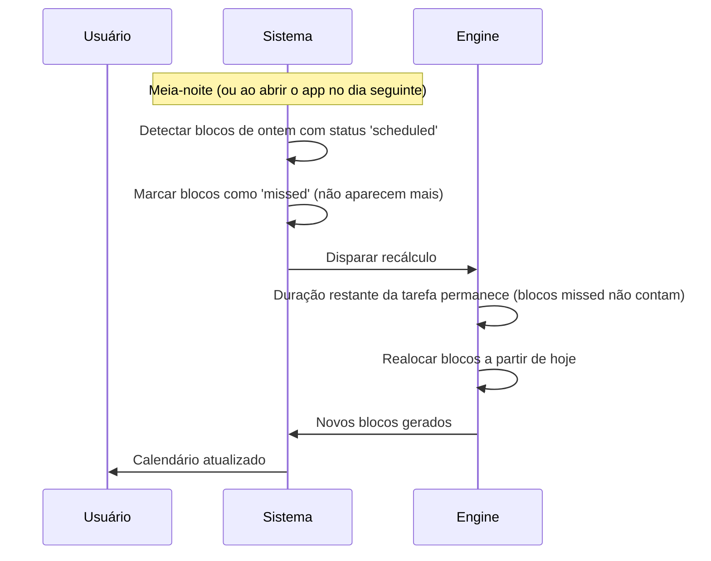
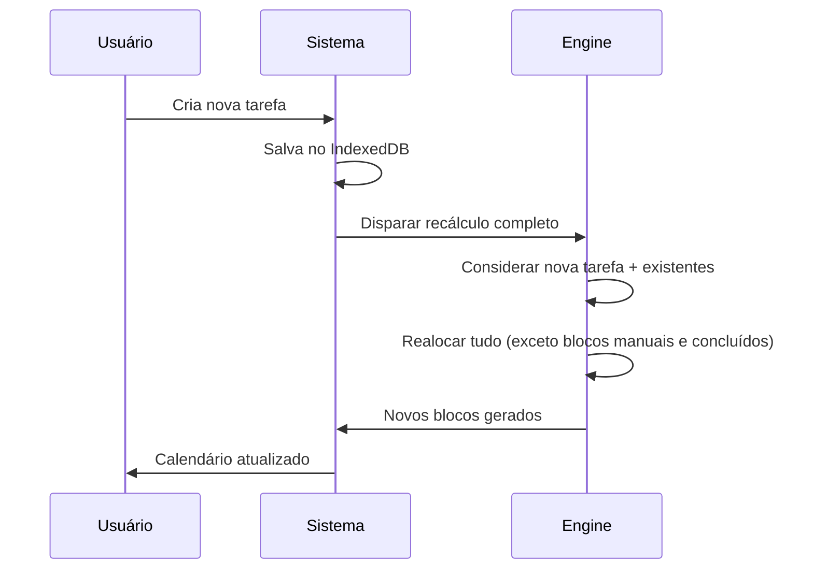
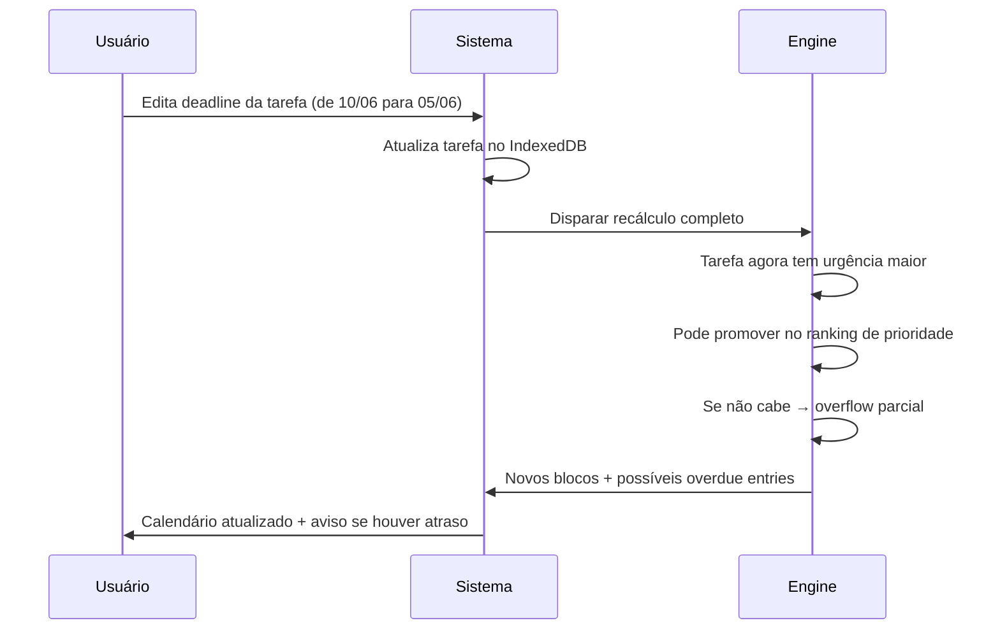
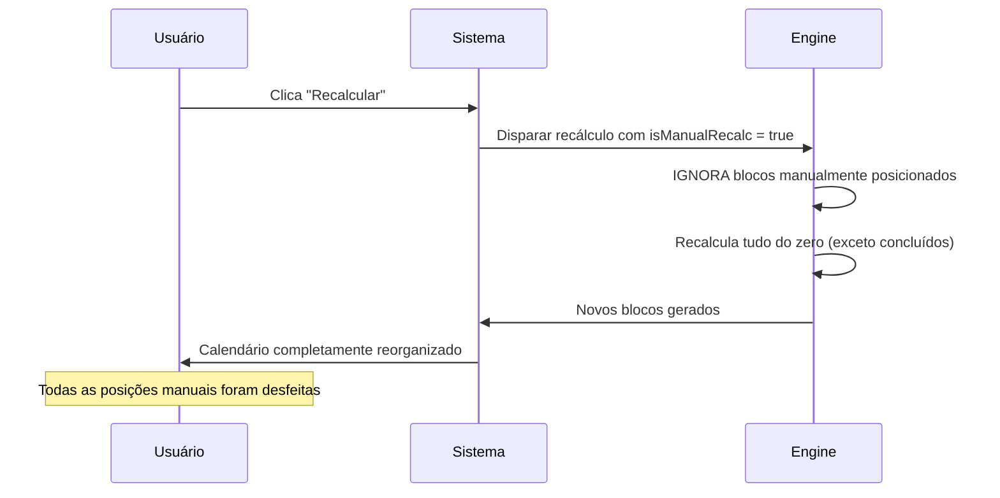
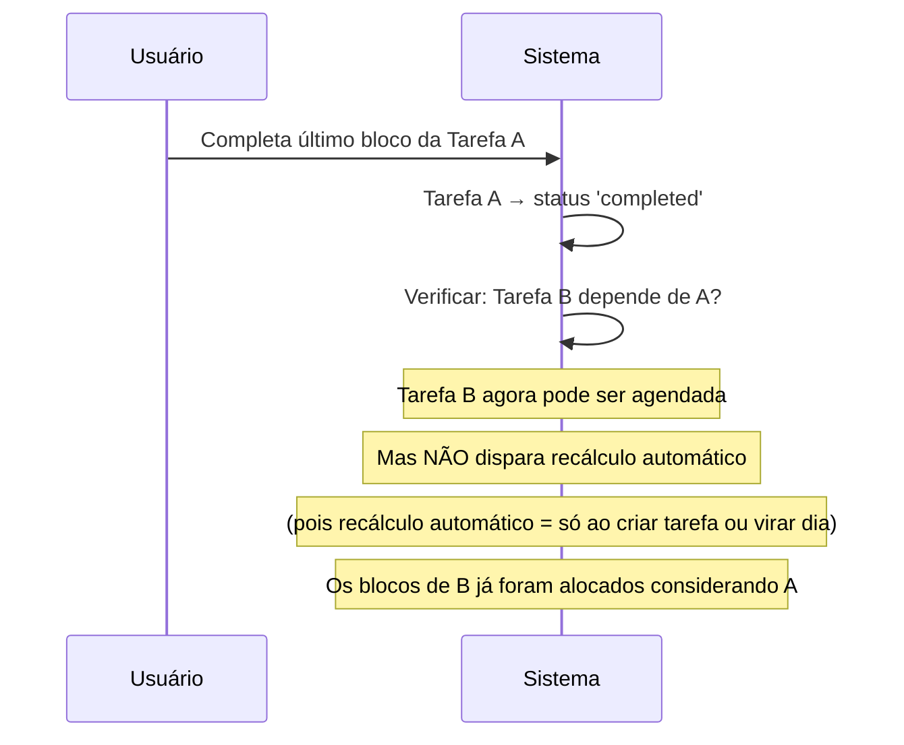

# 08 — Progresso e Recálculo

Este documento cobre como o usuário marca progresso nas tarefas e como o sistema recalcula a agenda em diferentes cenários.

---

## 8.1 Marcação de Blocos

### Como funciona

O usuário marca **blocos individuais de 45min** como concluídos, não a tarefa inteira. Isso permite progresso granular.

### Onde marcar

1. **No calendário**: hover sobre o bloco → aparece botão ✓ no canto
2. **Na task list**: barra de progresso clicável mostrando blocos

### Fluxo de conclusão de bloco

```typescript
async function completeBlock(blockId: BlockId) {
  // 1. Marcar bloco como concluído
  await db.blocks.update(blockId, { status: 'completed' });
  
  // 2. Atualizar duração concluída da tarefa
  const block = await db.blocks.get(blockId);
  if (!block) return;
  
  const task = await db.tasks.get(block.taskId);
  if (!task) return;
  
  const newCompleted = task.completedDuration + 45;
  
  // 3. Verificar se a tarefa foi totalmente concluída
  if (newCompleted >= task.totalDuration) {
    await db.tasks.update(task.id, {
      completedDuration: newCompleted,
      status: 'completed',
      updatedAt: new Date().toISOString(),
    });
    
    // 4. Verificar se tarefas dependentes podem ser desbloqueadas
    await checkDependentTasks(task.id);
    
    // 5. Notificar o usuário
    showToast(`🎉 "${task.name}" concluída!`, 'success');
  } else {
    await db.tasks.update(task.id, {
      completedDuration: newCompleted,
      status: 'in_progress',
      updatedAt: new Date().toISOString(),
    });
  }
  
  // 6. Recarregar stores
  await loadBlocks();
  await loadTasks();
}
```

### Desfazer conclusão

Se o usuário clicar em um bloco já concluído (no calendário), deve poder desfazer:

```typescript
async function uncompleteBlock(blockId: BlockId) {
  const block = await db.blocks.get(blockId);
  if (!block || block.status !== 'completed') return;
  
  // Reverter bloco
  await db.blocks.update(blockId, { status: 'scheduled' });
  
  // Reverter progresso da tarefa
  const task = await db.tasks.get(block.taskId);
  if (!task) return;
  
  await db.tasks.update(task.id, {
    completedDuration: Math.max(0, task.completedDuration - 45),
    status: task.completedDuration - 45 <= 0 ? 'pending' : 'in_progress',
    updatedAt: new Date().toISOString(),
  });
  
  await loadBlocks();
  await loadTasks();
}
```

---

## 8.2 Visualização de Progresso

### Na Task List

Cada tarefa mostra uma barra de progresso:

```tsx
function ProgressBar({ task }: { task: Task }) {
  const totalBlocks = task.totalDuration / 45;
  const completedBlocks = task.completedDuration / 45;
  const percentage = Math.round((completedBlocks / totalBlocks) * 100);
  
  return (
    <div className="task-progress">
      <div className="progress-bar">
        <div 
          className={`progress-bar__fill ${percentage === 100 ? 'progress-bar__fill--complete' : ''}`}
          style={{ width: `${percentage}%` }}
        />
      </div>
      <span className="task-progress__label">
        {completedBlocks}/{totalBlocks} blocos ({percentage}%)
      </span>
    </div>
  );
}
```

### No calendário

- **Blocos concluídos**: opacidade 0.35, com ícone ✓ sutil
- **Blocos pendentes**: opacidade total, cor vibrante
- **Em dias passados**: apenas blocos concluídos são visíveis

---

## 8.3 Cenários de Recálculo

### Cenário 1: Bloco não concluído → virada do dia



### Cenário 2: Tarefa criada



### Cenário 3: Tarefa editada (mudou deadline)



### Cenário 4: Recálculo manual (botão 🔄)



### Cenário 5: Bloco concluído que desbloqueou dependência



---

## 8.4 Detecção de Virada de Dia

O sistema precisa saber quando o dia virou para disparar o recálculo.

### Estratégia

```typescript
// src/hooks/useDayChange.ts

function useDayChange() {
  useEffect(() => {
    // 1. Ao abrir o app, verificar se o dia mudou desde o último acesso
    const lastDate = getStoredSetting('lastCalculationDate');
    const today = formatDate(new Date());
    
    if (lastDate && lastDate !== today) {
      // O dia mudou — processar blocos não concluídos e recalcular
      handleDayChange(lastDate, today);
    }
    
    // 2. Timer para detectar meia-noite em tempo real
    const now = new Date();
    const midnight = new Date(now);
    midnight.setHours(24, 0, 0, 0);
    const msUntilMidnight = midnight.getTime() - now.getTime();
    
    const timer = setTimeout(() => {
      handleDayChange(today, formatDate(new Date()));
    }, msUntilMidnight);
    
    return () => clearTimeout(timer);
  }, []);
}

async function handleDayChange(previousDate: string, newDate: string) {
  // 1. Marcar blocos não concluídos de dias passados como 'missed'
  const allBlocks = await db.blocks.toArray();
  const missedBlocks = allBlocks.filter(b => 
    b.date <= previousDate && b.status === 'scheduled'
  );
  
  for (const block of missedBlocks) {
    await db.blocks.update(block.id, { status: 'missed' });
  }
  
  // 2. Atualizar data de último cálculo
  await db.settings.put({ key: 'lastCalculationDate', value: newDate });
  
  // 3. Recalcular
  await runScheduler({ isManualRecalc: false });
  
  // 4. Recarregar stores
  await loadBlocks();
  await loadTasks();
}
```

---

## 8.5 Blocos Manuais vs Automáticos

### Comportamento de blocos manualmente posicionados

| Situação | Bloco manual | Bloco automático |
|---|---|---|
| Recálculo automático (nova tarefa, virada de dia) | **Mantido na posição** | Recalculado |
| Recálculo manual (botão 🔄) | **Removido** → recalculado | Recalculado |
| Bloco concluído | Permanente | Permanente |
| Dia virou sem concluir | Marcado como missed | Marcado como missed |

### Como um bloco se torna manual

```typescript
// Ao arrastar um bloco no calendário
async function moveBlock(blockId: BlockId, newDate: string, newStartTime: string) {
  const block = await db.blocks.get(blockId);
  if (!block) return;
  
  // Não pode mover blocos concluídos ou no passado
  if (block.status === 'completed') return;
  if (isDateBefore(newDate, today())) return;
  
  const newEndTime = addMinutesToTime(newStartTime, 45);
  
  await db.blocks.update(blockId, {
    date: newDate,
    startTime: newStartTime,
    endTime: newEndTime,
    isManuallyPlaced: true,
  });
  
  // NÃO recalcular — posição manual persiste
  await loadBlocks();
}
```

### Validação ao mover bloco

```typescript
function canMoveBlockTo(block: ScheduledBlock, date: string, time: string): boolean {
  // 1. Não pode ser no passado
  if (isDateBefore(date, today())) return false;
  
  // 2. Não pode sobrepor outro bloco
  const existingBlocks = getBlocksForDate(date);
  const newStart = timeToMinutes(time);
  const newEnd = newStart + 45;
  
  for (const existing of existingBlocks) {
    if (existing.id === block.id) continue;
    const existStart = timeToMinutes(existing.startTime);
    const existEnd = timeToMinutes(existing.endTime);
    
    if (newStart < existEnd && newEnd > existStart) {
      return false; // Sobreposição
    }
  }
  
  return true;
}
```

---

## 8.6 Dias Passados no Calendário

Ao navegar para dias passados:

| Elemento | Comportamento |
|---|---|
| Blocos concluídos | ✅ Visíveis, com opacidade reduzida (0.35) |
| Blocos missed | ❌ Invisíveis (foram retirados e realocados para o futuro) |
| Blocos agendados | ❌ Impossível (se hoje > dia do bloco e não foi concluído → missed) |
| Intervalos | Visíveis entre blocos concluídos |
| Botão completar | Escondido (não pode completar bloco no passado) |
| Drag-and-drop | Desabilitado |

### Limpeza visual de dias passados

```typescript
function getVisibleBlocksForDate(date: string): ScheduledBlock[] {
  const blocks = getBlocksForDate(date);
  
  if (isDateBefore(date, today())) {
    // Dia passado: mostrar apenas concluídos
    return blocks.filter(b => b.status === 'completed');
  }
  
  // Hoje ou futuro: mostrar agendados + concluídos
  return blocks.filter(b => b.status === 'scheduled' || b.status === 'completed');
}
```

---

## 8.7 Feedback Visual de Ações

| Ação | Feedback |
|---|---|
| Bloco concluído | Animação: bloco "fades" para opacidade reduzida + ✓ aparece. Toast "Bloco concluído!" |
| Tarefa inteira concluída | Toast especial "🎉 Tarefa X concluída!" + confetti sutil (micro-animação) |
| Bloco movido manualmente | Bloco ganha bordinha indicando que é manual (pontilhada?) |
| Recálculo executado | Breve flash/shimmer no calendário + Toast "Agenda recalculada" |
| Virada do dia detectada | Toast "Novo dia! Agenda recalculada." |

### Indicador de bloco manual

```css
.task-block--manual {
  border-style: dashed !important;
  border-width: 2px;
}

.task-block--manual::after {
  content: '✋';
  position: absolute;
  top: 2px;
  right: 4px;
  font-size: 10px;
}
```

---

## 8.8 Checklist

- [ ] Implementar `completeBlock()` com atualização de tarefa
- [ ] Implementar `uncompleteBlock()` para desfazer
- [ ] Implementar `ProgressBar` com blocos visuais
- [ ] Implementar detecção de virada de dia (`useDayChange` hook)
- [ ] Implementar marcação de blocos missed na virada do dia
- [ ] Implementar trigger de recálculo automático (criar/editar/excluir tarefa, virar dia)
- [ ] Implementar botão recalcular manual com `isManualRecalc = true`
- [ ] Implementar drag-and-drop de blocos com `isManuallyPlaced`
- [ ] Implementar validação de drop (sem sobreposição, não no passado)
- [ ] Implementar filtragem de blocos em dias passados (só concluídos)
- [ ] Implementar verificação de dependências desbloqueadas
- [ ] Implementar feedback visual (toasts, animações)
- [ ] Implementar indicador visual de bloco manual (borda pontilhada)
- [ ] Testar cenários: virada de dia, recálculo manual, blocos manuais

---

## Próximo Documento

→ [09-SISTEMA-ATRASADAS.md](./09-SISTEMA-ATRASADAS.md) — Sistema de tarefas atrasadas
