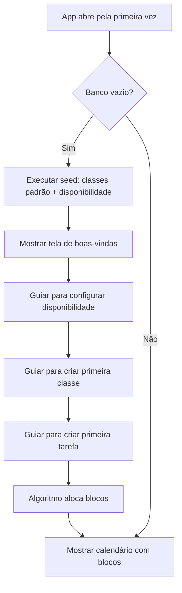

# 10 — Integração e Polish

Este documento cobre a integração de todos os sistemas, tratamento de edge cases, animações de polish, e a experiência final do usuário.

---

## 10.1 Fluxo Completo Integrado

### Primeiro acesso (onboarding)



### Tela de boas-vindas

```
┌──────────────────────────────────────────────────┐
│                                                  │
│              ◆ THEOMIN ◆                         │
│                                                  │
│     Seu tempo, alocado com inteligência.          │
│                                                  │
│  Vamos começar configurando seus horários         │
│  disponíveis e suas primeiras tarefas.            │
│                                                  │
│           ┌──────────────────────┐               │
│           │   Começar setup →    │               │
│           └──────────────────────┘               │
│                                                  │
└──────────────────────────────────────────────────┘
```

---

## 10.2 Edge Cases Críticos

### EC-1: Sem disponibilidade configurada

```
Se o usuário não configurou nenhum horário disponível:
→ Mostrar aviso: "Configure seus horários disponíveis para que o Theomin possa agendar tarefas."
→ Bloquear criação de tarefas até que haja ao menos 1 faixa configurada
→ Exceção: tarefas de horário fixo podem ser criadas (são independentes)
```

### EC-2: Tarefa com prazo impossível

```
Se a tarefa precisa de 10h mas só há 3h disponíveis entre início e deadline:
→ Ao criar: mostrar aviso "⚠ Só é possível alocar 3h antes do prazo. O restante (7h) será marcado como atrasado."
→ Permitir criar mesmo assim (o usuário pode querer)
→ Alocar 3h no calendário, 7h vão para overdue imediatamente
```

### EC-3: Dependência circular detectada

```
Se o usuário tentar criar A → B → C → A:
→ Bloquear no formulário de dependências
→ Mostrar: "Dependência circular detectada! Tarefa C já depende indiretamente de A."
→ Não permitir salvar
```

### EC-4: Excluir classe com tarefas

```
→ Modal: "A classe 'Faculdade' possui 5 tarefas ativas."
→ Opção 1: "Mover para [dropdown de classes]"
→ Opção 2: "Excluir tarefas também" (com confirmação extra)
```

### EC-5: Duas tarefas no mesmo slot (conflito de bloco manual)

```
Se o usuário arrasta manualmente um bloco para cima de outro:
→ Não permitir o drop (snap de volta)
→ Visual feedback: slot fica vermelho durante hover
```

### EC-6: Recorrência sem dias selecionados

```
Se o usuário marca "tarefa recorrente" mas não seleciona nenhum dia:
→ Botão "Salvar" desabilitado
→ Mensagem: "Selecione pelo menos um dia da semana"
```

### EC-7: Horário fixo fora do horário disponível

```
Tarefas de horário fixo são independentes do tempo livre.
→ Se o usuário configura uma tarefa fixa às 20h, mas seus slots vão até 17h:
→ Comportamento NORMAL — é proposital (ex: aulas, treino)
→ Mostrar apenas um info: "ℹ Este horário está fora dos seus horários livres configurados"
```

### EC-8: App aberto em múltiplas abas

```
Se o usuário abre o Theomin em duas abas:
→ Dexie.js suporta liveQuery — mudanças em uma aba refletem na outra
→ Mas o recálculo pode causar race conditions
→ Solução: usar um lock no IndexedDB (ou navigator.locks API) para serializar recálculos
```

---

## 10.3 Micro-Animações e Polish

### Transições de View

```css
/* Ao trocar entre Calendar/Tasks/Classes/etc */
.view-enter {
  animation: fadeIn 200ms ease, slideUp 200ms ease;
}

.view-exit {
  animation: fadeOut 150ms ease;
}

@keyframes fadeOut {
  from { opacity: 1; }
  to { opacity: 0; }
}
```

### Hover effects nos blocos do calendário

```css
.task-block {
  transition: all 150ms ease;
}

.task-block:hover {
  box-shadow: 0 4px 12px hsla(0, 0%, 0%, 0.4);
  transform: translateY(-1px) scale(1.01);
  z-index: 5;
}
```

### Conclusão de bloco

```css
@keyframes block-complete {
  0% { 
    background: var(--color-success); 
    transform: scale(1.02);
  }
  100% { 
    background: color-mix(in srgb, var(--block-color) 15%, var(--bg-elevated));
    opacity: var(--completed-opacity);
    transform: scale(1);
  }
}

.task-block--just-completed {
  animation: block-complete 500ms ease;
}
```

### Conclusão de tarefa

```css
@keyframes confetti-burst {
  0% { 
    opacity: 1;
    transform: translateY(0) scale(1);
  }
  100% { 
    opacity: 0;
    transform: translateY(-30px) scale(0.5);
  }
}

/* Partículas de "confetti" ao completar tarefa */
.confetti-particle {
  position: absolute;
  width: 6px;
  height: 6px;
  border-radius: 50%;
  animation: confetti-burst 600ms ease forwards;
  pointer-events: none;
}
```

### Recálculo

```css
@keyframes recalc-shimmer {
  0% { opacity: 1; }
  50% { opacity: 0.6; }
  100% { opacity: 1; }
}

.calendar--recalculating {
  animation: recalc-shimmer 400ms ease;
}
```

### Drag-and-drop

```css
/* Bloco sendo arrastado */
.task-block--dragging {
  opacity: 0.8;
  box-shadow: 0 8px 24px hsla(0, 0%, 0%, 0.5);
  transform: scale(1.05);
  z-index: 100;
  cursor: grabbing;
}

/* Slot de destino válido */
.time-grid__drop-zone--valid {
  background: hsla(265, 70%, 58%, 0.1);
  border: 2px dashed var(--accent-base);
}

/* Slot de destino inválido */
.time-grid__drop-zone--invalid {
  background: hsla(0, 65%, 55%, 0.1);
  border: 2px dashed var(--color-danger);
}
```

### Sidebar

```css
.sidebar {
  transition: width 250ms cubic-bezier(0.34, 1.56, 0.64, 1);
}

.sidebar--collapsed {
  width: var(--sidebar-collapsed);
}

.sidebar__label {
  transition: opacity 150ms ease;
}

.sidebar--collapsed .sidebar__label {
  opacity: 0;
  pointer-events: none;
}
```

---

## 10.4 Atalhos de Teclado

| Atalho | Ação |
|---|---|
| `N` | Nova tarefa (abre modal) |
| `T` | Ir para hoje |
| `1` | Visão diária |
| `2` | Visão semanal |
| `←` / `→` | Navegar (dia anterior/próximo ou semana anterior/próxima) |
| `R` | Recalcular agenda |
| `Esc` | Fechar modal |
| `Ctrl + Z` | Desfazer última ação |

```typescript
// src/hooks/useKeyboardShortcuts.ts
function useKeyboardShortcuts() {
  useEffect(() => {
    function handleKeyDown(e: KeyboardEvent) {
      // Ignorar se está digitando em um input
      if (e.target instanceof HTMLInputElement || e.target instanceof HTMLTextAreaElement) return;
      
      switch (e.key) {
        case 'n': openTaskModal(); break;
        case 't': goToToday(); break;
        case '1': setViewType('day'); break;
        case '2': setViewType('week'); break;
        case 'ArrowLeft': goBackward(); break;
        case 'ArrowRight': goForward(); break;
        case 'r': recalculate(); break;
        case 'Escape': closeModal(); break;
      }
    }
    
    window.addEventListener('keydown', handleKeyDown);
    return () => window.removeEventListener('keydown', handleKeyDown);
  }, []);
}
```

---

## 10.5 Tooltip de Atalhos

Ao pressionar `?`, mostrar um overlay com todos os atalhos:

```
┌──────────────────────────────────────────┐
│  Atalhos de Teclado              ✕       │
│  ────────────────────────────────────    │
│                                          │
│  N           Nova tarefa                 │
│  T           Ir para hoje                │
│  1           Visão diária                │
│  2           Visão semanal               │
│  ← →         Navegar                     │
│  R           Recalcular                  │
│  Esc         Fechar modal                │
│  ?           Mostrar atalhos             │
│                                          │
└──────────────────────────────────────────┘
```

---

## 10.6 Performance

### Otimizações implementáveis

| Área | Otimização |
|---|---|
| Calendário | `React.memo` em cada `TaskBlock` e `DayColumn` |
| Stores | Seletores Zustand granulares (não re-render tudo) |
| Algoritmo | Debounce no recálculo (se múltiplas edições rápidas) |
| IndexedDB | Transações batch ao salvar muitos blocos |
| Scroll | Virtual scrolling se muitas horas no grid (desnecessário com 24h) |

### Debounce do recálculo

```typescript
const debouncedRecalculate = useMemo(
  () => debounce(async () => {
    setIsRecalculating(true);
    await runScheduler({ isManualRecalc: false });
    setIsRecalculating(false);
  }, 300),
  []
);
```

---

## 10.7 Persistência e Inicialização

### Fluxo de boot do app

```typescript
// src/App.tsx
function App() {
  const [ready, setReady] = useState(false);
  
  useEffect(() => {
    async function boot() {
      // 1. Abrir banco IndexedDB
      await db.open();
      
      // 2. Verificar se é primeiro acesso
      const isFirstRun = (await db.tasks.count()) === 0 && (await db.classes.count()) === 0;
      
      if (isFirstRun) {
        await seedDatabase();
        setShowOnboarding(true);
      }
      
      // 3. Carregar todos os stores
      await Promise.all([
        loadTasks(),
        loadClasses(),
        loadAvailability(),
        loadBlocks(),
      ]);
      
      // 4. Verificar virada de dia
      await checkDayChange();
      
      // 5. App pronto
      setReady(true);
    }
    
    boot();
  }, []);
  
  if (!ready) return <SplashScreen />;
  
  return <AppShell />;
}
```

### Splash Screen

```css
.splash-screen {
  display: flex;
  align-items: center;
  justify-content: center;
  height: 100vh;
  background: var(--bg-deep);
}

.splash-logo {
  font-size: var(--text-3xl);
  font-weight: var(--weight-bold);
  color: var(--accent-base);
  animation: pulse-glow 2s ease infinite;
}
```

---

## 10.8 Tratamento de Erros

### Estratégia

```typescript
// Error boundary global
class ErrorBoundary extends React.Component {
  componentDidCatch(error: Error, errorInfo: React.ErrorInfo) {
    console.error('Theomin error:', error, errorInfo);
    // Mostrar UI de fallback
  }
  
  render() {
    if (this.state.hasError) {
      return (
        <div className="error-fallback">
          <h2>Algo deu errado 😔</h2>
          <p>Tente recarregar a página.</p>
          <Button onClick={() => window.location.reload()}>
            Recarregar
          </Button>
        </div>
      );
    }
    return this.props.children;
  }
}
```

### Erros específicos

| Erro | Tratamento |
|---|---|
| IndexedDB indisponível | Fallback para localStorage (modo degradado) |
| Erro no algoritmo | Log detalhado + toast "Erro ao calcular agenda" |
| Ciclo de dependência | Bloquear no form, mostrar quais tarefas formam o ciclo |
| Data inválida | Validação no form, impedir envio |

---

## 10.9 Acessibilidade (a11y)

| Requisito | Implementação |
|---|---|
| Contraste | Verificar todas as cores contra WCAG AA em dark mode |
| Focus visible | Outline personalizado com accent color em todos os interativos |
| Aria labels | Em todos os botões com ícone (ex: `aria-label="Recalcular agenda"`) |
| Keyboard navigation | Tab order lógico, Enter/Space para ativar |
| Screen reader | `role="grid"` no calendário, `role="gridcell"` em cada slot |
| Drag-and-drop | @dnd-kit tem suporte a11y built-in (keyboard sensors) |

```css
/* Focus visible estilizado */
*:focus-visible {
  outline: 2px solid var(--accent-base);
  outline-offset: 2px;
  border-radius: var(--radius-sm);
}
```

---

## 10.10 Checklist de Integração

- [ ] Implementar fluxo de boot com carregamento de stores
- [ ] Implementar splash screen
- [ ] Implementar seed database para primeiro acesso
- [ ] Implementar onboarding simples (wizard 3 passos)
- [ ] Tratar edge case: sem disponibilidade
- [ ] Tratar edge case: prazo impossível
- [ ] Tratar edge case: dependência circular
- [ ] Tratar edge case: exclusão de classe com tarefas
- [ ] Tratar edge case: conflito de blocos manuais
- [ ] Implementar atalhos de teclado
- [ ] Implementar overlay de atalhos (?)
- [ ] Implementar micro-animações (conclusão, recálculo, drag)
- [ ] Implementar debounce no recálculo
- [ ] Implementar Error Boundary
- [ ] Implementar tratamento de erros do IndexedDB
- [ ] Verificar acessibilidade (contraste, focus, aria)
- [ ] Verificar performance com React DevTools
- [ ] Testar integração completa end-to-end

---

## Próximo Documento

→ [11-MVP-ROADMAP.md](./11-MVP-ROADMAP.md) — Definição do MVP, ordem de implementação e roadmap pós-MVP
