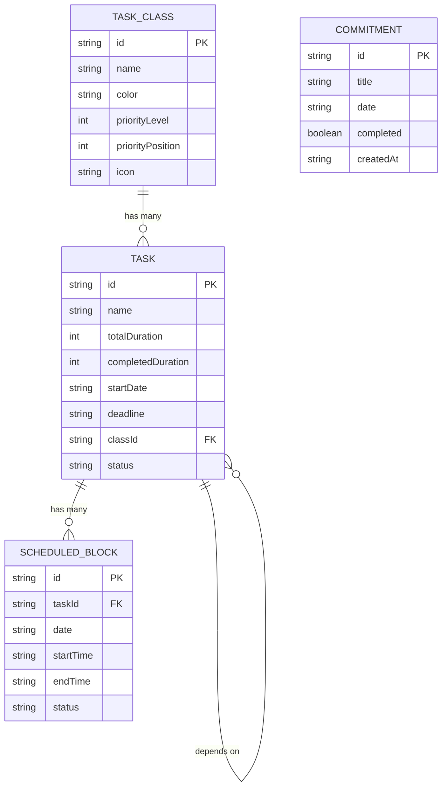

# 12 — Compromissos Importantes

Este documento cobre a implementação do sistema de **Compromissos Importantes** — uma funcionalidade complementar ao calendário que permite ao usuário registrar eventos/datas importantes (provas, entregas, compromissos) sem que sejam tarefas do sistema de alocação. Inspirada no **Google Tasks**, com criação inline e listagem ordenada por data.

---

## 12.1 Conceito

### O que são Compromissos Importantes?

São **marcos com data** que o usuário quer lembrar. **Não são tarefas** — não possuem duração, não são alocadas no calendário em blocos, e não passam pelo motor de scheduling.

**Exemplos:**
- "Prova de Cálculo III" em 10/06/2026
- "Apresentação do TCC" em 15/06/2026
- "Entrega do relatório final" em 20/06/2026
- "Consulta médica" em 05/06/2026

### Diferenças entre Compromissos e Tarefas

| Aspecto | Tarefa | Compromisso |
|---------|--------|-------------|
| Duração estimada | Sim (múltiplos de 45min) | Não |
| Alocação no calendário | Sim (blocos automáticos) | Não (apenas data) |
| Classe/prioridade | Sim | Não |
| Dependências | Sim | Não |
| Recorrência | Sim | Não |
| Motor de scheduling | Participa | Não participa |
| Progresso | Blocos concluídos | Concluído ou não |
| **Propósito** | **Quanto tempo preciso trabalhar?** | **Quando vai acontecer?** |

---

## 12.2 Posicionamento na UI

O painel de Compromissos Importantes fica **abaixo da área de seleção de abas (sidebar)** da tela do calendário. Especificamente:

```
┌──────────────────┐
│  🐻 Theomin       │  ← Logo
│                    │
│  📅 Calendário     │  ← Nav items
│  ✅ Tarefas        │
│  📑 Classes        │
│  ⏰ Disponibilidade│
│  ⚠ Atrasadas       │
│                    │
│  ─── separador ─── │
│                    │
│  📌 Compromissos   │  ← Seção de Compromissos
│      Importantes   │
│                    │
│  ┌──────────────┐  │
│  │ 📅 10/06      │  │  ← Lista de compromissos
│  │ Prova Cálculo │  │     ordenada por data mais
│  └──────────────┘  │     próxima primeiro
│  ┌──────────────┐  │
│  │ 📅 15/06      │  │
│  │ Apresentação  │  │
│  │ TCC           │  │
│  └──────────────┘  │
│  ┌──────────────┐  │
│  │ 📅 20/06      │  │
│  │ Relatório     │  │
│  │ final         │  │
│  └──────────────┘  │
│                    │
│  ┌──────────────┐  │
│  │     + Novo    │  │  ← Botão para adicionar
│  └──────────────┘  │
│                    │
└──────────────────┘
```

### Regras de posicionamento

1. O painel fica **dentro da sidebar**, logo abaixo dos itens de navegação
2. Há um **separador visual** (linha sutil) entre a navegação e os compromissos
3. A seção tem um **título fixo** ("Compromissos Importantes") com ícone 📌 (Pin do Lucide)
4. A lista é **scrollável independentemente** se houver muitos compromissos
5. O botão `+` fica **fixo no final** da seção
6. Quando a sidebar está colapsada, a seção fica oculta (só mostrar ao expandir)

---

## 12.3 Modelo de Dados

### Tipo TypeScript

```typescript
// src/types/commitment.ts

export type CommitmentId = string;  // nanoid

export interface Commitment {
  id: CommitmentId;
  
  /** Título do compromisso (ex: "Prova de Cálculo III") */
  title: string;
  
  /** Data do compromisso */
  date: string;  // ISO date string 'YYYY-MM-DD'
  
  /** Se já foi concluído/passou */
  completed: boolean;
  
  /** Data de criação */
  createdAt: string;  // ISO datetime
}
```

### Schema IndexedDB — Migração

**IMPORTANTE**: Deve-se fazer uma migração do banco, adicionando a tabela `commitments` na versão 2 do schema:

```typescript
// src/db/database.ts — ATUALIZADO

export class TheominDB extends Dexie {
  tasks!: Table<Task, string>;
  classes!: Table<TaskClass, string>;
  availabilityExceptions!: Table<AvailabilityException, string>;
  blocks!: Table<ScheduledBlock, string>;
  settings!: Table<{ key: string; value: any }, string>;
  commitments!: Table<Commitment, string>;  // NOVO

  constructor() {
    super('TheominDB');
    
    this.version(1).stores({
      tasks: 'id, classId, status, deadline, startDate, [status+deadline]',
      classes: 'id, priorityLevel, [priorityLevel+priorityPosition]',
      availabilityExceptions: 'id, date',
      blocks: 'id, taskId, date, [date+startTime], [taskId+date]',
      settings: 'key',
    });
    
    // VERSÃO 2: Adiciona tabela de compromissos
    this.version(2).stores({
      tasks: 'id, classId, status, deadline, startDate, [status+deadline]',
      classes: 'id, priorityLevel, [priorityLevel+priorityPosition]',
      availabilityExceptions: 'id, date',
      blocks: 'id, taskId, date, [date+startTime], [taskId+date]',
      settings: 'key',
      commitments: 'id, date, completed',  // NOVA TABELA
    });
  }
}
```

### Índices

| Tabela | Índice | Para que serve |
|--------|--------|----------------|
| `commitments` | `date` | Ordenar por data (listar em ordem cronológica) |
| `commitments` | `completed` | Filtrar/separar concluídos dos pendentes |

---

## 12.4 Store Zustand

```typescript
// src/stores/commitmentStore.ts
import { create } from 'zustand';
import { db } from '@/db/database';
import { Commitment, CommitmentId } from '@/types/commitment';
import { nanoid } from 'nanoid';

interface CommitmentState {
  commitments: Commitment[];
  loading: boolean;
  
  // Actions
  loadCommitments: () => Promise<void>;
  addCommitment: (title: string, date: string) => Promise<Commitment>;
  updateCommitment: (id: CommitmentId, updates: Partial<Commitment>) => Promise<void>;
  deleteCommitment: (id: CommitmentId) => Promise<void>;
  toggleCompleted: (id: CommitmentId) => Promise<void>;
  
  // Queries
  /** Retorna compromissos pendentes, ordenados por data mais próxima primeiro */
  getPendingCommitments: () => Commitment[];
  /** Retorna compromissos concluídos */
  getCompletedCommitments: () => Commitment[];
}

export const useCommitmentStore = create<CommitmentState>((set, get) => ({
  commitments: [],
  loading: false,
  
  loadCommitments: async () => {
    set({ loading: true });
    const commitments = await db.commitments.toArray();
    set({ commitments, loading: false });
  },
  
  addCommitment: async (title: string, date: string) => {
    const commitment: Commitment = {
      id: nanoid(),
      title,
      date,
      completed: false,
      createdAt: new Date().toISOString(),
    };
    
    await db.commitments.add(commitment);
    set(state => ({ commitments: [...state.commitments, commitment] }));
    return commitment;
  },
  
  updateCommitment: async (id, updates) => {
    await db.commitments.update(id, updates);
    set(state => ({
      commitments: state.commitments.map(c => 
        c.id === id ? { ...c, ...updates } : c
      ),
    }));
  },
  
  deleteCommitment: async (id) => {
    await db.commitments.delete(id);
    set(state => ({
      commitments: state.commitments.filter(c => c.id !== id),
    }));
  },
  
  toggleCompleted: async (id) => {
    const commitment = get().commitments.find(c => c.id === id);
    if (!commitment) return;
    
    const newCompleted = !commitment.completed;
    await db.commitments.update(id, { completed: newCompleted });
    set(state => ({
      commitments: state.commitments.map(c =>
        c.id === id ? { ...c, completed: newCompleted } : c
      ),
    }));
  },
  
  getPendingCommitments: () => {
    return get().commitments
      .filter(c => !c.completed)
      .sort((a, b) => a.date.localeCompare(b.date));  // Mais próximo primeiro
  },
  
  getCompletedCommitments: () => {
    return get().commitments
      .filter(c => c.completed)
      .sort((a, b) => b.date.localeCompare(a.date));  // Mais recente primeiro
  },
}));
```

---

## 12.5 Componentes

### Estrutura de arquivos

```
src/components/commitments/
├── CommitmentsPanel.tsx       # Painel inteiro (título + lista + botão)
├── CommitmentItem.tsx         # Item individual na lista
├── CommitmentForm.tsx         # Form inline para criar/editar
└── CommitmentsPanel.css       # Estilos
```

### CommitmentsPanel — Painel Principal

Este componente é renderizado **dentro da Sidebar**, abaixo dos itens de navegação.

```tsx
// src/components/commitments/CommitmentsPanel.tsx

import { useState } from 'react';
import { Pin, Plus } from 'lucide-react';
import { useCommitmentStore } from '@/stores/commitmentStore';
import { CommitmentItem } from './CommitmentItem';
import { CommitmentForm } from './CommitmentForm';
import './CommitmentsPanel.css';

export function CommitmentsPanel() {
  const [isAdding, setIsAdding] = useState(false);
  const pendingCommitments = useCommitmentStore(state => 
    state.commitments
      .filter(c => !c.completed)
      .sort((a, b) => a.date.localeCompare(b.date))
  );
  
  const handleAdd = async (title: string, date: string) => {
    await useCommitmentStore.getState().addCommitment(title, date);
    setIsAdding(false);
  };
  
  return (
    <div className="commitments-panel">
      <div className="commitments-panel__header">
        <Pin size={16} />
        <span>Compromissos Importantes</span>
      </div>
      
      <div className="commitments-panel__list">
        {pendingCommitments.map(commitment => (
          <CommitmentItem 
            key={commitment.id} 
            commitment={commitment} 
          />
        ))}
        
        {pendingCommitments.length === 0 && !isAdding && (
          <div className="commitments-panel__empty">
            Nenhum compromisso
          </div>
        )}
      </div>
      
      {isAdding ? (
        <CommitmentForm 
          onSubmit={handleAdd} 
          onCancel={() => setIsAdding(false)} 
        />
      ) : (
        <button 
          className="commitments-panel__add-btn"
          onClick={() => setIsAdding(true)}
        >
          <Plus size={16} />
          <span>Novo compromisso</span>
        </button>
      )}
    </div>
  );
}
```

### CommitmentItem — Item Individual

```tsx
// src/components/commitments/CommitmentItem.tsx

import { useState } from 'react';
import { Calendar, Check, Trash2, X } from 'lucide-react';
import { Commitment } from '@/types/commitment';
import { useCommitmentStore } from '@/stores/commitmentStore';
import { format, parseISO, isToday, isTomorrow, isPast, differenceInDays } from 'date-fns';
import { ptBR } from 'date-fns/locale';

interface CommitmentItemProps {
  commitment: Commitment;
}

export function CommitmentItem({ commitment }: CommitmentItemProps) {
  const [showActions, setShowActions] = useState(false);
  const { toggleCompleted, deleteCommitment } = useCommitmentStore();
  
  const date = parseISO(commitment.date);
  const today = new Date();
  const daysUntil = differenceInDays(date, today);
  
  // Formatar label de data
  const getDateLabel = (): string => {
    if (isToday(date)) return 'Hoje';
    if (isTomorrow(date)) return 'Amanhã';
    if (daysUntil < 0) return `${Math.abs(daysUntil)}d atrás`;
    if (daysUntil <= 7) return `em ${daysUntil}d`;
    return format(date, 'dd/MM', { locale: ptBR });
  };
  
  // Classe CSS para urgência
  const getUrgencyClass = (): string => {
    if (isPast(date) && !isToday(date)) return 'commitment-item--overdue';
    if (isToday(date)) return 'commitment-item--today';
    if (daysUntil <= 3) return 'commitment-item--urgent';
    return '';
  };
  
  return (
    <div 
      className={`commitment-item ${getUrgencyClass()} ${commitment.completed ? 'commitment-item--completed' : ''}`}
      onMouseEnter={() => setShowActions(true)}
      onMouseLeave={() => setShowActions(false)}
    >
      <button 
        className="commitment-item__checkbox"
        onClick={() => toggleCompleted(commitment.id)}
        title={commitment.completed ? 'Desmarcar' : 'Marcar como concluído'}
      >
        {commitment.completed && <Check size={12} />}
      </button>
      
      <div className="commitment-item__content">
        <span className="commitment-item__title">{commitment.title}</span>
        <span className="commitment-item__date">
          <Calendar size={10} />
          {getDateLabel()}
        </span>
      </div>
      
      {showActions && (
        <button 
          className="commitment-item__delete"
          onClick={() => deleteCommitment(commitment.id)}
          title="Excluir compromisso"
        >
          <Trash2 size={12} />
        </button>
      )}
    </div>
  );
}
```

### CommitmentForm — Formulário Inline

O formulário aparece inline, estilo Google Tasks — compacto e direto:

```tsx
// src/components/commitments/CommitmentForm.tsx

import { useState, useRef, useEffect } from 'react';
import { Check, X } from 'lucide-react';

interface CommitmentFormProps {
  onSubmit: (title: string, date: string) => void;
  onCancel: () => void;
  initialTitle?: string;
  initialDate?: string;
}

export function CommitmentForm({ 
  onSubmit, 
  onCancel, 
  initialTitle = '', 
  initialDate = '' 
}: CommitmentFormProps) {
  const [title, setTitle] = useState(initialTitle);
  const [date, setDate] = useState(initialDate);
  const titleRef = useRef<HTMLInputElement>(null);
  
  useEffect(() => {
    titleRef.current?.focus();
  }, []);
  
  const handleSubmit = () => {
    if (!title.trim() || !date) return;
    onSubmit(title.trim(), date);
  };
  
  const handleKeyDown = (e: React.KeyboardEvent) => {
    if (e.key === 'Enter') handleSubmit();
    if (e.key === 'Escape') onCancel();
  };
  
  return (
    <div className="commitment-form">
      <input
        ref={titleRef}
        className="commitment-form__input"
        placeholder="Título do compromisso..."
        value={title}
        onChange={e => setTitle(e.target.value)}
        onKeyDown={handleKeyDown}
      />
      <input
        type="date"
        className="commitment-form__date"
        value={date}
        onChange={e => setDate(e.target.value)}
        onKeyDown={handleKeyDown}
      />
      <div className="commitment-form__actions">
        <button 
          className="commitment-form__btn commitment-form__btn--confirm"
          onClick={handleSubmit}
          disabled={!title.trim() || !date}
          title="Confirmar"
        >
          <Check size={14} />
        </button>
        <button 
          className="commitment-form__btn commitment-form__btn--cancel"
          onClick={onCancel}
          title="Cancelar"
        >
          <X size={14} />
        </button>
      </div>
    </div>
  );
}
```

---

## 12.6 Estilos (Tema Obsidiana)

```css
/* src/components/commitments/CommitmentsPanel.css */

/* ===== PANEL ===== */
.commitments-panel {
  display: flex;
  flex-direction: column;
  padding: var(--space-sm) var(--space-md);
  border-top: 1px solid var(--border-subtle);
  margin-top: auto;
  max-height: 50%;
}

.commitments-panel__header {
  display: flex;
  align-items: center;
  gap: var(--space-sm);
  font-size: var(--text-xs);
  font-weight: var(--weight-semibold);
  color: var(--text-muted);
  text-transform: uppercase;
  letter-spacing: 0.05em;
  padding: var(--space-sm) var(--space-xs);
  margin-bottom: var(--space-xs);
}

.commitments-panel__list {
  flex: 1;
  overflow-y: auto;
  display: flex;
  flex-direction: column;
  gap: 2px;
}

.commitments-panel__empty {
  font-size: var(--text-xs);
  color: var(--text-disabled);
  text-align: center;
  padding: var(--space-lg) 0;
}

/* ===== ADD BUTTON ===== */
.commitments-panel__add-btn {
  display: flex;
  align-items: center;
  gap: var(--space-sm);
  padding: var(--space-sm) var(--space-md);
  font-size: var(--text-sm);
  color: var(--text-muted);
  border-radius: var(--radius-md);
  transition: all var(--transition-fast);
  margin-top: var(--space-xs);
}

.commitments-panel__add-btn:hover {
  background: var(--bg-elevated);
  color: var(--accent-base);
}

/* ===== COMMITMENT ITEM ===== */
.commitment-item {
  display: flex;
  align-items: flex-start;
  gap: var(--space-sm);
  padding: var(--space-xs) var(--space-sm);
  border-radius: var(--radius-sm);
  transition: background var(--transition-fast);
  position: relative;
}

.commitment-item:hover {
  background: var(--bg-elevated);
}

/* Checkbox */
.commitment-item__checkbox {
  width: 16px;
  height: 16px;
  min-width: 16px;
  border: 1.5px solid var(--border-strong);
  border-radius: var(--radius-full);
  display: flex;
  align-items: center;
  justify-content: center;
  margin-top: 2px;
  transition: all var(--transition-fast);
  color: white;
  flex-shrink: 0;
}

.commitment-item__checkbox:hover {
  border-color: var(--accent-base);
  background: var(--accent-subtle);
}

.commitment-item--completed .commitment-item__checkbox {
  background: var(--color-success);
  border-color: var(--color-success);
}

/* Content */
.commitment-item__content {
  flex: 1;
  min-width: 0;
  display: flex;
  flex-direction: column;
  gap: 1px;
}

.commitment-item__title {
  font-size: var(--text-xs);
  font-weight: var(--weight-medium);
  color: var(--text-primary);
  white-space: nowrap;
  overflow: hidden;
  text-overflow: ellipsis;
  line-height: 1.3;
}

.commitment-item--completed .commitment-item__title {
  text-decoration: line-through;
  color: var(--text-muted);
}

.commitment-item__date {
  display: flex;
  align-items: center;
  gap: 3px;
  font-size: 10px;
  color: var(--text-muted);
  font-family: var(--font-mono);
}

/* Urgency states */
.commitment-item--today .commitment-item__date {
  color: var(--color-warning);
  font-weight: var(--weight-semibold);
}

.commitment-item--urgent .commitment-item__date {
  color: var(--color-warning);
}

.commitment-item--overdue .commitment-item__date {
  color: var(--color-danger);
  font-weight: var(--weight-semibold);
}

.commitment-item--overdue .commitment-item__title {
  color: var(--color-danger);
}

/* Delete button */
.commitment-item__delete {
  position: absolute;
  right: 4px;
  top: 50%;
  transform: translateY(-50%);
  width: 20px;
  height: 20px;
  display: flex;
  align-items: center;
  justify-content: center;
  border-radius: var(--radius-sm);
  color: var(--text-muted);
  transition: all var(--transition-fast);
}

.commitment-item__delete:hover {
  background: var(--color-danger);
  color: white;
}

/* ===== INLINE FORM ===== */
.commitment-form {
  display: flex;
  flex-direction: column;
  gap: var(--space-xs);
  padding: var(--space-sm);
  background: var(--bg-elevated);
  border: 1px solid var(--border-default);
  border-radius: var(--radius-md);
  margin-top: var(--space-xs);
  animation: fadeIn 150ms ease;
}

.commitment-form__input {
  font-size: var(--text-xs) !important;
  padding: var(--space-xs) var(--space-sm) !important;
  background: var(--bg-base) !important;
  border: 1px solid var(--border-subtle) !important;
  border-radius: var(--radius-sm) !important;
}

.commitment-form__date {
  font-size: var(--text-xs) !important;
  padding: var(--space-xs) var(--space-sm) !important;
  background: var(--bg-base) !important;
  border: 1px solid var(--border-subtle) !important;
  border-radius: var(--radius-sm) !important;
  color-scheme: dark;
}

.commitment-form__actions {
  display: flex;
  gap: var(--space-xs);
  justify-content: flex-end;
}

.commitment-form__btn {
  width: 28px;
  height: 28px;
  display: flex;
  align-items: center;
  justify-content: center;
  border-radius: var(--radius-sm);
  transition: all var(--transition-fast);
}

.commitment-form__btn--confirm {
  color: var(--color-success);
}

.commitment-form__btn--confirm:hover:not(:disabled) {
  background: var(--color-success);
  color: white;
}

.commitment-form__btn--confirm:disabled {
  opacity: 0.3;
  cursor: not-allowed;
}

.commitment-form__btn--cancel {
  color: var(--text-muted);
}

.commitment-form__btn--cancel:hover {
  background: var(--color-danger);
  color: white;
}
```

---

## 12.7 Integração na Sidebar

### Modificações necessárias na Sidebar existente

A `Sidebar.tsx` precisa renderizar o `CommitmentsPanel` abaixo dos itens de navegação:

```tsx
// src/components/ui/Sidebar.tsx — MODIFICADO

import { CommitmentsPanel } from '@/components/commitments/CommitmentsPanel';

export function Sidebar({ activeView, onNavigate }: SidebarProps) {
  // ... código existente ...

  return (
    <nav className="sidebar">
      <div className="sidebar__logo">
        {/* ... logo existente ... */}
      </div>

      <ul className="sidebar__nav">
        {/* ... itens de navegação existentes (Calendário, Tarefas, Classes, etc.) ... */}
      </ul>

      {/* NOVO: Seção de Compromissos Importantes */}
      <CommitmentsPanel />
    </nav>
  );
}
```

### Ajustes de CSS na Sidebar

A sidebar precisa de `display: flex; flex-direction: column;` para que o `CommitmentsPanel` ocupe o espaço restante com `margin-top: auto`:

```css
/* Verificar/adicionar no CSS da sidebar existente */
.sidebar {
  display: flex;
  flex-direction: column;
  height: 100vh;
  /* ... outros estilos existentes ... */
}

.sidebar__nav {
  /* manter estilos existentes */
}
```

---

## 12.8 Integração no App

### Carregar compromissos no boot

No `App.tsx`, adicionar o carregamento do store de compromissos junto com os outros stores:

```typescript
// src/App.tsx — MODIFICADO

import { useCommitmentStore } from '@/stores/commitmentStore';

// No useEffect de boot:
await Promise.all([
  useTaskStore.getState().loadTasks(),
  useClassStore.getState().loadClasses(),
  useAvailabilityStore.getState().loadAvailability(),
  useCommitmentStore.getState().loadCommitments(),  // NOVO
]);
```

---

## 12.9 Interações e UX

### Fluxo de criação (estilo Google Tasks)

1. Usuário clica em `+ Novo compromisso` na sidebar
2. Aparece um **form inline** com campo de título (autofocado) e campo de data
3. Usuário digita o título e seleciona a data
4. Pressiona **Enter** ou clica no botão ✓ para confirmar
5. Pressiona **Escape** ou clica no botão ✕ para cancelar
6. O novo compromisso aparece na lista, na posição correta (ordenado por data)

### Fluxo de conclusão

1. Ao clicar no **checkbox circular** do compromisso, ele é marcado como `completed`
2. O compromisso sai da lista de pendentes (opcionalmente com animação de fadeOut)
3. Clicar novamente desfaz a conclusão

### Fluxo de exclusão

1. Ao fazer **hover** no item, aparece um botão de lixeira (🗑)
2. Clicar no botão exclui o compromisso diretamente (sem modal de confirmação, pois é uma ação simples)

### Ordenação

- Compromissos **pendentes** são listados com data mais próxima primeiro (ascending)
- Compromissos **concluídos** não aparecem na lista principal (ficam ocultos)

### Indicadores visuais de urgência

| Situação | Visual |
|----------|--------|
| Data já passou | Texto da data em **vermelho**, título em vermelho |
| Data é hoje | Texto da data em **amarelo/âmbar**, negrito |
| Data em 1-3 dias | Texto da data em **amarelo/âmbar** |
| Data em 4+ dias | Texto da data em cinza (normal) |

---

## 12.10 Diagrama ER Atualizado



> **Nota**: `COMMITMENT` é uma entidade independente, sem relações com as outras tabelas.

---

## 12.11 Checklist de Implementação

### Modelo de Dados
- [ ] Criar `src/types/commitment.ts` com tipo `Commitment` e `CommitmentId`
- [ ] Atualizar `src/db/database.ts` — adicionar tabela `commitments` na versão 2 do schema
- [ ] Criar `src/stores/commitmentStore.ts` com CRUD + `getPendingCommitments()` + `getCompletedCommitments()`

### Componentes
- [ ] Criar `src/components/commitments/CommitmentsPanel.tsx` — painel principal com título + lista + botão add
- [ ] Criar `src/components/commitments/CommitmentItem.tsx` — item com checkbox, título, data, botão delete
- [ ] Criar `src/components/commitments/CommitmentForm.tsx` — form inline com título + date picker
- [ ] Criar `src/components/commitments/CommitmentsPanel.css` — estilos tema Obsidiana

### Integração
- [ ] Modificar `src/components/ui/Sidebar.tsx` — renderizar `CommitmentsPanel` abaixo dos nav items
- [ ] Verificar/ajustar CSS da sidebar para `display: flex; flex-direction: column` 
- [ ] Modificar `src/App.tsx` — carregar `commitmentStore` no boot (`loadCommitments()`)

### Funcionalidades
- [ ] Implementar criação inline (form aparece ao clicar `+`)
- [ ] Implementar conclusão (checkbox toggle)
- [ ] Implementar exclusão (botão delete no hover)
- [ ] Implementar ordenação por data (mais próxima primeiro)
- [ ] Implementar indicadores visuais de urgência (overdue, today, urgent)
- [ ] Implementar labels de data inteligentes (Hoje, Amanhã, em Xd, dd/MM)

### Testes
- [ ] Testar criação de compromisso com Enter e com botão ✓
- [ ] Testar cancelamento com Escape e com botão ✕
- [ ] Testar ordenação (compromisso com data mais próxima aparece primeiro)
- [ ] Testar conclusão e desfazer conclusão
- [ ] Testar exclusão
- [ ] Testar com muitos compromissos (scroll funcional)
- [ ] Testar que a migração do banco funciona sem perda de dados (v1 → v2)
- [ ] Verificar visual no tema Obsidiana (cores, fontes, espaçamentos)

---

## 12.12 Ordem de Implementação

Esta feature pode ser implementada em **paralelo** com qualquer sprint, pois não depende de nenhum sistema existente (não interage com tarefas, blocos, ou scheduling). A ordem sugerida é:

1. **Tipo** (`commitment.ts`) — 5 min
2. **Migração do banco** (`database.ts` v2) — 10 min
3. **Store** (`commitmentStore.ts`) — 20 min
4. **CSS** (`CommitmentsPanel.css`) — 20 min
5. **CommitmentForm** (mais simples, sem dependências) — 15 min
6. **CommitmentItem** (depende do store) — 20 min
7. **CommitmentsPanel** (compõe Form + Item) — 15 min
8. **Integração Sidebar** (render do panel) — 10 min
9. **Integração App.tsx** (load no boot) — 5 min
10. **Testes e polish** — 20 min

**Tempo estimado total**: ~2h30

---

## Próximo Documento

← [11-MVP-ROADMAP.md](./11-MVP-ROADMAP.md) — Roadmap e sprints de implementação
